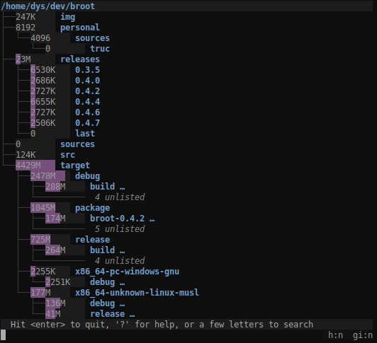

# Broot

[![CI][s3]][l3] [![MIT][s2]][l2] [![Latest Version][s1]][l1] [![Chat on Miaou][s4]][l4]

[s1]: https://img.shields.io/crates/v/broot.svg
[l1]: https://crates.io/crates/broot

[s2]: https://img.shields.io/badge/license-MIT-blue.svg
[l2]: LICENSE

[s3]: https://travis-ci.org/Canop/broot.svg?branch=master
[l3]: https://travis-ci.org/Canop/broot

[s4]: https://miaou.dystroy.org/static/shields/room.svg
[l4]: https://miaou.dystroy.org/3490?broot

A better way to navigate directories

### Get an overview of a directory, even a big one:

Notice the "unlisted"? That's what makes it usable where the old `tree` command would produce pages of output.

`.gitignore` files are properly dealt with to put unwanted files out of your way (if you want to see git ignored files, type `:gi`).

### Find a directory then `cd` to it:

This way, you can navigate to a directory with the minimum amount of keystrokes, even if you don't exactly remember where it is.

broot is fast and never blocks, even when you make it search a big slow disk (any keystroke interrupts the current search to start the next one).

Most useful keys for this:

* the letters of what you're looking for
* `<enter>` to select a directory (staying in broot)
* `<esc>` to get back to the previous state or clear your search
* `<alt><enter>` to get back to the shell having `cd` to the selected directory
* `:q` if you just want to quit (`<esc>` works too)

### Never lose track of file hierarchy while you fuzzy search:

broot tries to select the most relevant file. You can still go from one match to another one using `<tab>` or arrow keys.

You may also search with a regular expression. To do this, add a `/` before or after the pattern.

Complex regular expression are possible, but you'll probably most often use a regex to do an "exact" search, or search an expression at the start or end of the filename.

For example, assuming you look for your one file whose name contains `abc` in a big directory, you may not see it immediately because of many fuzzy matches. In that case, just add a slash at the end to change you fuzzy search into an exact expression: `abc/`.

And if you look for a filename *ending* in `abc` then you may anchor the regex: `abc$/`.

### See what takes space:

To toggle size display, type `:s`. Sizes are computed in the background, you don't have to wait for them when you navigate.

### Apply a personal shortcut to a file:

Just find the file you want to edit with a few keystrokes, type `:e`, then `<enter>` (you should define your preferred editor, see [documentation](documentation.md#verbs)).

### More...

See **[Broot's web site](https://dystroy.org/broot)** for instructions regarding installation and usage.

