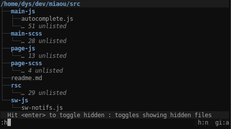
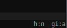

# Broot Documentation

## General Usage & Semantics

A broot command is typed in the input at the bottom and is made of two parts, a **pattern** and a **verb**, both optional, separated by either a space or `:`.

Example:

There the pattern is `car` and the verb shortcut is `e`.

The pattern filters the tree while you type. It's interpreted in a fuzzy way so that you don't have to type all the letters or even consecutive letters. The best match is automatically selected.

If there's a `/` before or after the patten, it's interpreted as a regular expression. For example `/pat+ern` would match `"patern.zip"` or `"some_patttern.rar"` but not `"pATTern"`. If you want the regex to be case insensitive, add the `i` flag: `pat+ern/i`.

At any moment you can use the arrow keys to move the selection. You can also use the tab key.

When you hit `<enter>`:

* if there's a verb, it is executed, which may quit broot or change its state
* if there's none, and a directory is selected, this directory becomes the new root and the pattern is cleared
* if there's no verb and a file is selected, `xdg-open` is called on the file

Hitting `<esc>` clears the current pattern, or brings you back to the previous root. If there is none, it quits broot.

Hitting `?` brings you to the help screen.

## Flags

Flags are displayed at the bottom right, showing the settings regarding hidden files and .gitignore rules.

## Verbs

The definition of a verb (which you'll find in the configuration file, see below) is made of three parts:

* an invocation string, which you should make short if you want to use on
* a name, which is used for inline help
* the execution

For example this one:

	[[verbs]]
	name = "edit"
	invocation = "e"
	execution = "/usr/bin/nvim {file}"

This means that typing `:e` then `<enter>` opens the selected file in neovim (when you're in the help screen, the selected file is broot's configuration file).

(this is a part of the default configuration, and probably the first verb you should change for your personal setup)

Most verbs aren't based on an external application but call internal functions:

### `:back` : get back to the previous state of the tree

This is normally achieved with the `esc` key but you might want to remap it.

### `:cd` : cd to a directory

`:cd` is the most useful verb but only works if you're using the `br` shell function to launch `broot`.

If you call it on a simple file, instead of a directory, the shell will be directed to the parent directory.

It's mapped to `<alt><enter>`.

### `:focus` : change the tree's root

`:focus` makes the selected directory become the new displayed root.

The difference from just using `<enter>` is that the current filtering pattern is kept.

In the default configuration, it's mapped to `g`.

### `:open` : call the OS standard program for the selected file

This is automatically called when you hit `<enter>` without a verb and a file (not a directory) is selected. Current implementation calls `xdg_open`.

In the default configuration, it's mapped to `o`.

### `:parent` : moves the view one level up

Display the parent directory.

In the default configuration, it's mapped to `p`.

### `:quit`

In the default configuration, it's mapped to `q`.

### `:toggle_files`

Switch between displaying only directories or showing everything.

In the default configuration, it's mapped to `f`.

### `:toggle_gitignore` : adjust git ignore rule respect

.gitignore files are parsed and used depending on the current "gitignore" setting:

* when "no", .gitignore files are ignored
* when "yes", each directory is filtered according to the applied gitignore files (several git repositories may be simultaneously shown and a git repository may define several .gitignore files)
* when "auto" (default value), gitignore rules are ignored unless the root directory is a git repository or inside one

This setting is displayed at the bottom right of the screen:

In the default configuration, it's mapped to `gi`.

### `:toggle_hidden`

Switch between showing or hiding hidden files (the ones whose name starts with a dot).

In the default configuration, it's mapped to `h`.

You can start broot with hidden files shown by using `broot --hidden` or `br -h`.

### `:toggle_perm` : display file permissions

Toggle displaying permissions in the classical `rwxrwxrwx user group` way.

In the default configuration, it's mapped to `perm`. You might want to remap it if you use it a lot.

### `:toggle_sizes`

Switch between displaying file & directory sizes or not.

Sizes are computed in the background, so this doesn't slow your navigation.

When sizes are displayed, all the direct children of the current root are displayed, which means there can be a scrollbar (you may use the page up and page down keys).

In the default configuration, it's mapped to `s` and can be activated at launch using `broot --sizes`.

## Configuration File

When broot starts, it checks for a configuration file in the standard location defined by your OS and creates one if there's none.

You can see this location by opening the help with `?`. You can also open it directly from the help screen by typing `:o`.

## Passing commands as program argument

*Note: this feature is experimental and will probably change.*

Commands to be executed can be passed using the `--cmd` argument, separated with a space.

### Directly search

    broot --cmd miaou /

This opens broot and immediately searches for "miaou" in `/` as if it were typed in broot's input.

### Go to the most relevant directory

    broot -c ":p miaou :g"

This opens broot, goes to the parent directory, searches for "miaou", then opens the selected directory (staying in broot).

A variant searching from your home directory:

    br -f -c "miaou :g" ~

### Define a function for deep fuzzy cd

In my .bashrc, I have this:

	# deep fuzzy cd
	function dcd {
		br --only-folders --cmd "$1 :c"
	}

This is the *"I'm feeling lucky"* of broot, I use it to directly jump to directories I know, when I don't need the interactive search of br.

Example:

