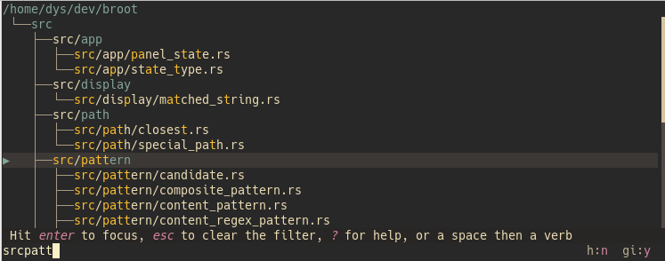
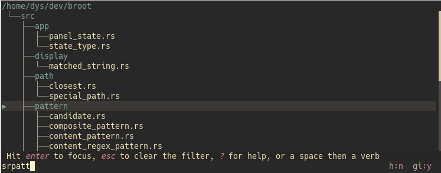

# Reset

If you want to get back to the default set of configuration files, delete or rename the `broot` directory in your standard configuration place (e.g. `~/.config/broot`).
On next launch, broot will recreate all the necessary files.

# Hjson or TOML

Two formats are allowed: [TOML](https://github.com/toml-lang/toml) and [Hjson](https://hjson.github.io/).

This documentation will often show you the same setting in both formats, with two tabs, like this:

```Hjson
// setting to use if your config file is in .hjson
```
```TOML
# setting to use if your config file is in .toml
```

# Opening the config files

The main configuration file is called either `conf.toml` or `conf.hjson`.


This default file's location follows the XDG convention, which depends on your system settings. This location in your case can be found on the help screen (use <kbd>?</kbd>).

The default configuration file contains several example sections that you may uncomment and modify for your goals.

It typically imports other files in the same directory.

# Imports

A configuration file can import some other files.
This eases management, as you may for example define your skin in a file, or the list of verbs in another one.

An import can have as condition whether the terminal is in dark or light mode, so that broot can take the most suitable skin on launch.

All imports are defined in an `imports` array.

For example:

```Hjson
imports: [

	verbs.toml

	{
		luma: light
		file: white-skin.hjson
	}

	{
		luma: [
			dark
			unknown
		]
		file: dark-blue-skin.hjson
	}

]
```

This example defines 3 imports.

The first one has the simplest form: just a (relative or absolute) path. This import isn't conditional.

The second import is done only if the terminal's *luma* is determined to be light.

And the third one is done when the terminal's luma is either dark or couldn't be determined.

Starting from version 1.14, the default configuration is released in several files.

!!!	Note
	Be careful when installing a configuration file from an unknown source: it may contain an arbitrary command to execute. Check it before importing it

!!! Note
	 On non linux systems, Background color determination is currently disabled (always "unknown"). This is expected to be fixed.

# Default flags

Broot accepts a few flags at launch (the complete list is available with `broot --help`).
The `default_flags` entry lets you specify them in configuration, with the same syntax.

For example, if you want to see hidden files (the ones whose name starts with a dot) and the status of files related to git, you launch broot with

    br -gh

If you almost always want those flags, you may define them as default in the configuration file file, with the `default_flags` setting.

```Hjson
default_flags: -gh
```
```TOML
default_flags = "-gh"
```

Those flags can still be overridden at launch with the negating ones. For example, with the above `default_flags`, if you don't want to see hidden files on a specific launch, do

    br -H

# Special Paths

You may map special paths to specific behaviors. You may for example

- have some link to a directory to always automatically be handled as a normal directory
- exclude some path because it's on a slow device or non relevant
- have a file be visible even while it's normally ignored

A special paths entry is defined by 3 parameters: `show`, `list`, and `sum`.
Each of them can be `default`, `always`, or `never`.

Example configuration:

```Hjson
special_paths: {
    "/media" : {
        list: "never"
        sum: "never"
    }
    "~/.config": { "show": "always" }
    "trav": {
        show: always
        list: "always",
        sum: "never"
    }
    "~/useless": { "show": "never" }
    "~/my-link-I-want-to-explore": { "list": "always" }
}
```
```TOML
[special-paths]
"/media" = { list = "never", sum = "never" }
"~/.config" = { show = "always" }
"trav" = { show = "always", list = "always", sum = "never" }
"~/useless" = { show = "never" }
"~/my-link-I-want-to-explore" = { list = "always" }
```

Be careful that those paths (globs, in fact) are checked a lot when broot builds trees and that defining a lot of paths will impact the overall speed.

# Search Modes

It's possible to redefine the mode mappings, for example if you usually prefer to do exact searches:

```Hjson
"search-modes": {
    <empty>: regex name
    /: fuzzy path
    z/: regex path
}
```
```TOML
[search-modes]
"<empty>" = "regex name"
"/" = "fuzzy path"
"z/" = "regex path"
```

The search mode must be made of two parts :

* the search kind: Either  `exact`, `fuzzy`, `regex`, or `tokens`
* the search object: Either `name`, `path`, or `content`

# Selection Mark

When the background colors aren't rendered in your terminal, aren't visible enough, or just aren't clear enough for you, you may have the selected lines marked with triangles with

```Hjson
show_selection_mark: true
```
```TOML
show_selection_mark = true
```

# Columns order

You may change the order of file attributes in file lists:

*  mark: a small triangle flagging the selected line
*  git : Git file info
*  branch : shows the depth and parent in the tree
*  permission : mode, user, group
*  date : last modification date
*  size : ISO size (and size bar when sorting)
*  count : number of files in directories
*  name : file name

For example, if you prefer to have the branches left of the tree (as was the default in broot prior 0.18.1) you can use

```Hjson
cols_order: [
	mark
	git
	branch
	permission
	date
	size
	count
	name
]
```
```TOML
cols_order = [
	"mark",
	"git",
	"branch",
	"permission",
	"date",
	"size",
	"count",
	"name",
]
```

The name should be kept at end as it's the only one with a variable size.

# Colors by file extension

broot doesn't support `LS_COLORS` which isn't available on all systems and is limited to 16 system dependent colors.

But you can still give a color to files by extension:

```Hjson
ext_colors: {
    png: "rgb(255, 128, 75)"
    rs: "yellow"
    toml: "ansi(105)"
}
```
```TOML
[ext-colors]
png = "rgb(255, 128, 75)"
rs = "yellow"
toml = "ansi(105)"
```

(see [here](../skins#color) for precision about the color syntax in broot)

# Syntax Theme

You can choose any of the following syntaxic coloring themes for previewed files:

* GitHub
* SolarizedDark
* SolarizedLight
* EightiesDark
* MochaDark
* OceanDark
* OceanLight

```Hjson
syntax_theme: OceanLight
```
```TOML
syntax_theme = "OceanLight"
```

Those themes come from [syntect](https://github.com/trishume/syntect) and are bundled in broot.


# Terminal title

If you set the `terminal_title` parameter, broot will change the title of the terminal when the current tree root changes.

The pattern allows using the same arguments than verb execution patterns, eg {file} or {git-name}.

```Hjson
terminal_title: "{file} 🐄"
```
```TOML
terminal_title = "{file} 🐄"
```

# Miscellaneous


## Maximal number of files added by a :stage_all_files command

```Hjson
max_staged_count: 1234
```
```TOML
max_staged_count = 1234
```

## Mouse Capture

Broot usually captures the mouse so that you can click or double click on items. If you want to disable this capture, you may add this:

```Hjson
capture_mouse: false
```
```TOML
capture_mouse = false
```

## Number of threads for directory size computation

Most users should not change this. In my measurements a number of 4 to 6 looks optimal.

```Hjson
file_sum_threads_count: 10,
```
```TOML
file_sum_threads_count = 10
```

## Quit on last cancel

You can usually cancel the last state change on escape.
If you want the escape key to quit broot when there's nothing to cancel (for example when you just opened broot), you can set `quit_on_last_cancel` to true.
this parameter

```Hjson
quit_on_last_cancel: true
```
```TOML
quit_on_last_cancel = true
```

## Update broot's work dir

By default, the work dir of the broot process is synchronized with the root of the current panel.
If you prefer to keep the work dir unchanged, disable this feature with

```Hjson
update_work_dir: false
```
```TOML
update_work_dir = false
```

## Only show file name even when the pattern is on paths

When your search pattern is applied to a path, the path is shown on each line so that you see why the line matches:



If you don't really need to see matching characters, you may get a cleaner display with just file names with this option:

```Hjson
show_matching_characters_on_path_searches: false
```
```TOML
show_matching_characters_on_path_searches = false
```

which gives this:


