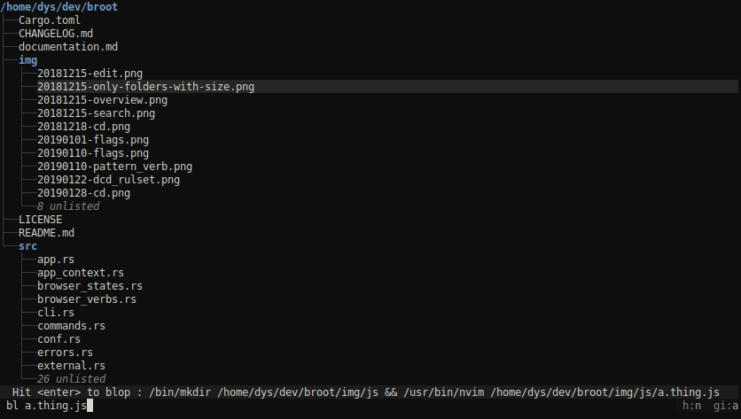

The most important part of broot configuration is the `verbs` sections, which let you define new commands or shortcuts.

# Verb Definition Attributes

You can define a new verb in the configuration file inside the `verbs` list.

```Hjson
{
	invocation: edit
	key: F2
	shortcut: e
	apply_to: file
	external: "nvim {file}"
	leave_broot: false
}
```
```TOML
[[verbs]]
invocation = "edit"
key = "F2"
shortcut = "e"
apply_to = "file"
external = "nvim {file}"
leave_broot = false
```

The possible attributes are:

name  | default | role
-|-|-
invocation | | how the verb is called by the user, with placeholders for arguments
internal | | execution, when your verb is based on a predefined broot verb
external | | execution, when your verb is based on an external command
cmd | | a semicolon sequence to execute, similar to an argument you pass to `--cmd`
extensions | | optional array of allowed file extensions
key | | a keyboard key triggering execution
keys | | several keyboard shortcuts triggering execution (if you want to have the choice)
shortcut | | an alternate way to call the verb (without the arguments part)
leave_broot | `true` | whether to quit broot on execution
from_shell | `false` | whether the verb must be executed from the parent shell (needs `br`). As this is executed after broot closed, this isn't compatible with `leave_broot = false`
apply_to | | the type of selection this verb applies to, may be `"file"`, `"directory"` or `"any"`. You may declare two verbs with the same key if the first one applies to only files or only directories
working_dir | | the working directory of the external application, for example `"{directory}"` for the closest directory (the working dir isn't set if the directory doesn't exist)
set_working_dir | `false` | whether the working dir of the process must be set to the currently selected directory (it's equivalent to `workding_dir: "{directory}"`)
auto_exec | `true` | whether to execute the verb as soon as it's key-triggered (instead of waiting for <kbd>enter</kbd>)
panels | *all* | optional list of panel types in which the verb can be called. Default is all panels: `[tree, fs, preview, help, stage]`

The execution is defined either by `internal`, `external` or `cmd` so a verb must have exactly one of those (for compatibility with older versions broot still accepts `execution` for `internal` or `external` and guesses which one it is).

!!!	Note
	The `from_shell` attribute exists because some actions can't possibly be useful from a subshell. For example `cd` is a shell builtin which must be executed in the parent shell.

# Using quotes

If you want broot, for example, to execute `xterm -e "nvim {file}"`, you may either escape the quotes as `\"` or use the array format to separate parts.

So the two following verb definitions are equivalent.

With escaping:

```hjson
{
	invocation: xtv
	external: "xterm -e \"nvim {file}\""
}
```
```toml
[[verbs]]
invocation = "xtv"
external = "xterm -e \"nvim {file}\""
```

With an array:

```hjson
{
	invocation: xtv
	external: ["xterm" "-e" "nvim {file}"]
}
```
```toml
[[verbs]]
invocation = "xtv"
external = ["xterm", "-e", "nvim {file}"]
```

# File extensions

You may filter the execution of a verb with file extensions.

For example, if you'd want <kbd>enter</kbd> to work as predefined in most cases but just choose a specific action for some files, you might add this verb definition:

```hjson
{
    name: open-code
    key: enter
    extensions: [
        rs
        js
        toml
    ]
    execution: "$EDITOR +{line} {file}"
    working_dir: "{root}"
    leave_broot: false
}
```
```toml
[[verbs]]
name = "open-code"
key = "enter"
extensions = ["rs", "js", "toml"]
execution = "$EDITOR +{line} {file}"
working_dir = "{root}"
leave_broot = false
```

Verbs are tried in order (the default ones after the user defined ones).
You may thus define first verbs with extension filter and then a catching-all one.

# Shortcuts and Verb search

**broot** looks for the first token following a space or `:` and tries to find the verb you want.

* If what you typed is exactly the shortcut or name of a verb, then this verb is selected: broot explains you what it would do if you were to type `enter`
* If there's exactly one verb whose name or shortcut starts with the characters you typed, then it's selected
* if there are several verbs whose name or shortcut start with the characters you typed, then broot waits for more
* if no verb has a name or shortcut starting with those characters, broot tells you there's a problem

Knowing this algorithm, you may understand the point in the following definition:

```toml
[[verbs]]
invocation = "p"
internal = ":parent"
```

This verb is an alias to the internal builtin already available if you type `:parent`.

Its interest is that if you do `:p`, then `enter`, it is executed even while there are other verbs whose invocation pattern starts with a `p`.

Use shortcuts for verbs you frequently use.

# Keyboard key

The main keys you can use are

* The function keys (for example <kbd>F3</kbd>)
* Ctrl and Alt keys (for example <kbd>ctrl</kbd><kbd>T</kbd>  or <kbd>alt</kbd><kbd>a</kbd>)

It's possible to define a verb just to add a trigger key to an internal verb.

For example you could add those mappings:

```hjson
verbs: [
    {
    	invocation: "root"
    	key: "F9"
    	internal: ":focus /"
    }
    {
    	invocation: "home"
    	key: "ctrl-H"
    	internal: ":focus ~"
    }
    {
    	key: "alt-j"
    	internal: ":line_down"
    }
    {
    	invocation: "top"
    	key: "F6"
    	internal: ":select_first"
    }
    {
    	invocation: "bottom"
    	key: F7
    	internal: ":select_last"
    }
    {
    	invocation: "open"
    	key: ctrl-O
    	internal: ":open_stay"
    }
    {
    	invocation: "edit"
        keys: [ // several possible shortcuts here
            F2
            ctrl-e
        ]
    	shortcut: "e"
    	external: "$EDITOR +{line} {file}"
    	from_shell: true
    }
]
```
```toml
[[verbs]]
invocation = "root"
key = "F9"
internal = ":focus /"

[[verbs]]
invocation = "home"
key = "ctrl-H"
internal = ":focus ~"

[[verbs]]
key = "alt-j"
internal = ":line_down"

[[verbs]]
invocation = "top"
key = "F6"
internal = ":select_first"

[[verbs]]
invocation = "bottom"
key = "F7"
internal = ":select_last"

[[verbs]]
invocation = "open"
key = "ctrl-O"
internal = ":open_stay"

[[verbs]]
invocation = "edit"
key = [ "F2", "ctrl-e" ]
shortcut = "e"
external = "$EDITOR +{line} {file}"
from_shell = true
```

Then,

* when doing <kbd>alt</kbd><kbd>J</kbd>, you would move the selection down (notice we don't need an invocation)
* when doing <kbd>Ctrl-H</kbd>, you would go to you user home (`~` when on linux),
* you would open files (without closing broot) with <kbd>ctrl-O</kbd>,
* <kbd>F7</kbd> would select the last line of the tree,
* and you'd switch to your favorite editor with <kbd>F2</kbd>

Beware that consoles intercept some possible keys. Many keyboard shortcuts aren't available, depending on your configuration. Some keys are also reserved in broot for some uses, for example the <kbd>enter</kbd> key always validate an input command if there's some. The <kbd>Tab</kbd>, <kbd>delete</kbd>, <kbd>backspace</kbd>, <kbd>esc</kbd> keys are reserved too.

## Verbs not leaving broot

If you set `leave_broot = false`, broot won't quit when executing your command, but it will update the tree.

This is useful for commands modifying the tree (like creating or moving files).

# Verb Arguments

The execution of a verb can take one or several arguments.

For example it may be defined as `vi {file}̀`.

Some arguments are predefined in broot and depends on the current selection:

name | expanded to
-|-
`{file}` | complete path of the current selection
`{file-name}` | file name of the current selection
`{file-extension}` | file extension of the current selection (example `rs` for `main.rs`)
`{file-stem}` | file name of the current selection
`{file-dot-extension}` | dot and extension of the current selection (example `.rs` for `main.rs`) or the empty string if there's no extension
`{line}` | number of selected line in the previewed file
`{parent}` | complete path of the current selection's parent
`{directory}` | closest directory, either `{file}` or `{parent}`
`{other-panel-file}` | complete path of the current selection in the other panel
`{other-panel-parent}` | complete path of the current selection's parent in the other panel
`{other-panel-directory}` | closest directory, either `{file}` or `{parent}` in the other panel
`{root}` | current tree root (top of the displayed files tree)

!!!	Note
	when you're in the help screen, `{file}` is the configuration file, while `{directory}` is the configuration directory.

But you may also define some arguments in the invocation pattern. For example:

```hjson
{
    invocation: "mkdir {subpath}"
    external: "mkdir -p {directory}/{subpath}"
}
```
```toml
[[verbs]]
invocation = "mkdir {subpath}"
external = "mkdir -p {directory}/{subpath}"
```

(the `mkdir` verb is standard so you don't have to write it in the configuration file)

In this case the subpath is read from what you type:


As you see, there's a space in this path, but it works. **broot** tries to determine when to wrap path in quotes and when to escape so that such a command correctly works.

It also normalizes the paths it finds which eases the use of relative paths:


Here's another example, where the invocation pattern defines two arguments by destructuring:

```hjson
{
    invocation: "blop {name}\\.{type}"
    external: "mkdir {parent}/{type} && nvim {parent}/{type}/{name}.{type}"
    from_shell: true
}
```
```toml
[[verbs]]
invocation = "blop {name}\\.{type}"
external = "mkdir {parent}/{type} && nvim {parent}/{type}/{name}.{type}"
from_shell = true
```

And here's how it would look like:



Notice the `\\.` in the invocation pattern ? That's because it is interpreted as a regular expression
(with just a shortcut for the easy case, enabling `{name}`).


The whole regular expression syntax may be useful for more complex rules.
Let's say we don't want the type to contain dots, then we do this:

```hjson
{
    invocation: "blop {name}\\.(?P<type>[^.]+)"
    external: "mkdir {parent}/{type} && nvim {parent}/{type}/{name}.{type}"
    from_shell: true
}
```
```toml
[[verbs]]
invocation = "blop {name}\\.(?P<type>[^.]+)"
external = "mkdir {parent}/{type} && nvim {parent}/{type}/{name}.{type}"
from_shell = true
```

You can override the default behavior of broot by giving your verb the same shortcut or invocation than a default one.

# Internals

Here's a list of internals: builtin actions you can add an alternate shortcut or keyboard key for:

invocation | default key | default shortcut | behavior / details
-|-|-|-
:back | <kbd>Esc</kbd> | - | back to previous app state (see Usage page) |
:cd | <kbd>alt</kbd><kbd>enter</kbd> | - | leave broot and cd to the selected directory (needs the br shell function)
:chmod {args} | - | - | execute a chmod
:clear_stage | - | cls | empty the staging area
:close_preview | - | - | close the preview panel
:close_staging_area | - | csa | close the staging area panel
:copy_path | <kbd>alt</kbd><kbd>c</kbd> | - | copy path
:cp {newpath} | - | - | copy the file or directory to the provided name
:focus | <kbd>enter</kbd> | - | set the selected directory the root of the displayed tree |
:help | <kbd>F1</kbd> | - | open the help page. Help page can also be open with <kbd>?</kbd>
:line_down | <kbd>↓</kbd> | - | scroll one line down or select the next line (can be used with an argument eg `:line_down 4`)
:line_down_no_cycle | - | - | same as line_down, but doesn't cycle
:line_up | <kbd>↑</kbd> | - | scroll one line up or select the previous line
:line_up_no_cycle | - | - | same as line_down, but doesn't cycle
:mkdir {subpath} | - | md | create a directory
:mv {newpath} | - | - | move the file or directory to the provided path
:no_sort | - | ns | remove all sorts
:next_dir | - | - | select the next directory
:next_match | <kbd>tab</kbd> | - | select the next matching file
:open_leave | <kbd>alt</kbd><kbd>enter</kbd> | - | open the selected file in the default OS opener and leave broot
:open_preview | - | - | open the preview panel
:open_staging_area | - | osa | open the staging area
:open_stay | <kbd>enter</kbd> | - | open the selected file in the default OS opener, or focus the directory
:open_stay_filter | - | - | focus the directory but keeping the current filtering pattern
:page_down | <kbd>⇟</kbd> | - | scroll one page down
:page_up | <kbd>⇞</kbd> | - | scroll one page up
:panel_left | <kbd>ctrl</kbd><kbd>←</kbd>  | - | move to or open a panel to the left
:panel_left_no_open | <kbd>ctrl</kbd><kbd>←</kbd>  | - | move to panel to the left
:panel_right | <kbd>ctrl</kbd><kbd>→</kbd>  | - | move to or open a panel to the right
:panel_right_no_open | <kbd>ctrl</kbd><kbd>→</kbd>  | - | move to panel to the right
:parent | - | - | focus the parent directory
:previous_dir | - | - | select the previous directory
:print_path | - | pp | print path and leave broot
:print_relative_path | - | pp | print relative path and leave broot
:print_tree | - | pt | print tree and leave broot
:quit | <kbd>ctrl</kbd><kbd>q</kbd> | q | quit broot
:refresh | <kbd>F5</kbd> | - | refresh the displayed tree and clears the directory sizes cache
:rm | - | - | remove the selected file or directory. To stay safe, don't define a keyboard key for this action
:select_first | - | - | select the first line
:select_last | - | - | select the last line
:select | - | - | select a path given as argument, if it's in the visible tree
:sort_by_count | - | sc | sort by count (only one level of the tree is displayed)
:sort_by_date | - | sd | sort by date
:sort_by_size | - | ss | sort by size
:sort_by_type | - | st | sort by type
:sort_by_type_dirs_first | - | - | sort by type, dirs first
:sort_by_type_dirs_last | - | - | sort by type, dirs last
:stage | <kbd>+</kbd> | - | add selection to staging area
:stage_all_files | <kbd>ctrl</kbd><kbd>a</kbd> | - | add all files verifying the pattern to the staging area
:toggle_counts | - | - | toggle display of total counts of files per directory
:toggle_dates | - | - | toggle display of last modified dates (looking for the most recently changed file, even deep)
:toggle_device_id | - | - | toggle display of device id (unix only)
:toggle_files | - | - | toggle showing files (or just folders)
:toggle_git_file_info | - | - | toggle display of git file information
:toggle_git_ignore | - | - | toggle git ignore handling (auto, no or yes)
:toggle_git_status | - | - | toggle showing only the file which would show up on `git status`
:toggle_hidden | - | - | toggle display of hidden files (the ones whose name starts with a dot on linux)
:toggle_perm | - | - | toggle display of permissions (not available on Windows)
:toggle_preview | - | - | toggle display of the preview panel
:toggle_second_tree | - | - | toggle displaying a second tree
:toggle_sizes | - | - | toggle the size mode
:toggle_stage | <kbd>ctrl</kbd><kbd>g</kbd> | - | add or remove selection to staging area
:toggle_staging_area | - | tsa | open/close the staging area panel
:toggle_trim_root | - | - | toggle trimming of top level files in tree display
:unstage | <kbd>-</kbd> | - | remove selection from staging area
:up_tree | - | - | focus the parent of the current root

Note that

- you can always call a verb with its default invocation, you don't *have* to define a shortcut
- verbs whose invocation needs an argument (like `{newpath}`) can't be triggered with just a keyboard key.

# Input related verbs

Some internal actions can be bound to a key shortcut but can't be called explicitly from the input because they directly act on the input field:

name | default binding | behavior
-|-|-
:input_clear | | empty the input,
:input_del_char_left | <kbd>delete</kbd> | delete the char left of the cursor
:input_del_char_below | <kbd>suppr</kbd> | delete the char left at the cursor's position
:input_del_word_left | - | delete the word left of the cursor
:input_del_word_right | - | delete the word right of the cursor
:input_go_to_end | <kbd>end</kbd> | move the cursor to the end of input
:input_go_left | <kbd>←</kbd> | move the cursor to the left
:input_go_right | <kbd>→</kbd> | move the cursor to the right
:input_go_to_start | <kbd>home</kbd> | move the cursor to the start of input
:input_go_word_left | - | move the cursor one word to the left
:input_go_word_right | - | move the cursor one word to the right
:input_selection_copy | - | copy the selected part of the input into the selection
:input_selection_cut | - | cut the selected part of the input into the selection
:input_paste | - | paste the clipboard content into the input

You may add this kind of shortcuts in the `verbs` section:

```hjson
{ key: "alt-b", internal: ":input_go_word_left" }
{ key: "alt-f", internal: ":input_go_word_right" }
{ key: "alt-l", internal: ":input_del_word_left" }
{ key: "alt-r", internal: ":input_del_word_right" }
```
```toml
[[verbs]]
key = "alt-b"
internal = ":input_go_word_left"

[[verbs]]
key = "alt-f"
internal = ":input_go_word_right"

[[verbs]]
key = "alt-l"
internal = ":input_del_word_left"

[[verbs]]
key = "alt-r"
internal = ":input_del_word_right"
```

## Copy, Cut, Paste, in input

Pasting into input is bound to <kbd>ctrl</kbd><kbd>V</kbd> but copying from input and cutting aren't bound by default, because you don't usually write long texts here.
You may add those bindings if you wish:

```hjson
{ key: "ctrl-c", internal: ":input_selection_copy" }
{ key: "ctrl-x", internal: ":input_selection_cut" }
```
```toml
[[verbs]]
key = "ctrl-c"
internal = ":input_selection_copy"
[[verbs]]
key = "ctrl-x"
internal = ":input_selection_cut"
```

# Focus

The `:focus` internal has many uses.

It can be used without explicit argument in which case it takes the selection (for example `:!focus` is equivalent to <kbd>ctrl</kbd><kbd>→</kbd>).

It can be used with an argument, for example you can go to a specific place without leaving broot by typing ` fo /usr/bin` then <kbd>enter</kbd>.

You may also want to use it in some cases instead of <kbd>enter</kbd> because it keeps the active filter.

It serves as base for several built-in commands, like `:home` whose execution is `:focus ~` (`~` is interpreted in broot as the user home even on Windows).

And you can add your own ones:

```hjson
{ key: "ctrl-up", internal: ":focus .." }
{ key: "ctrl-d", internal: ":focus ~/dev" }
{ // make :go an alias of :focus
    invocation: "go {path}",
    internal: ":focus {path}"
}
{
    invocation: "gotar {path}",
    internal: ":focus {path}/target"
}
```
```toml
[[verbs]]
key = "ctrl-up"
internal = ":focus .."

[[verbs]]
key = "ctrl-d"
internal = ":focus ~/dev"
```

# cmd execution

The `cmd` argument lets you define a sequence, just like the one you give to broot with [the `--cmd` argument](../launch/#the-cmd-launch-argument).

Such a sequence can contain some searches, some calls to internals, some calls to already defined external based verbs.

For example:

```Hjson
{
    name: "backup"
    invocation: "bu {name}"
    cmd: ":cp {file}-back_{name};:!focus {file}-back_{name}"
    apply_to: directory
}
```
```TOML
[[verbs]]
name = "backup"
invocation = "bu {name}"
cmd = ":cp {file}-back_{name};:!focus {file}-back_{name}"
apply_to = "directory"
```

This verb, which is only available when a directory is selected, copies this directory with a name partially composed from the command and focus the new directory in a new panel

!!!	Note
	The `cmd` execution type is still experimental in verbs and the precise behavior may change in future minor versions of broot


