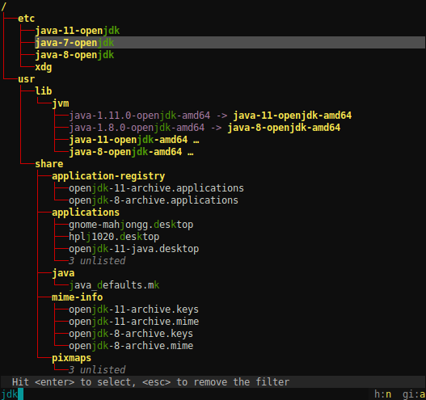
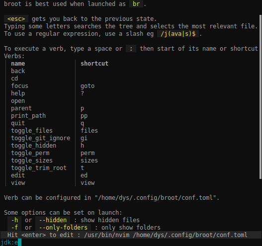

# Opening the configuration file

The configuration file location follows the XDG convention and its location depends on your OS.

The easiest way to read and edit broot's configuration file is to go the help screen (using <kbd>?</kbd>) then to type `:open`.

This file is called conf.toml and is in [TOML](https://github.com/toml-lang/toml).

Currently, you can configure

* verbs
* colors

# Verbs

## Verb Definition Attributes

You can define a new verb in the TOML configuration file with a `[[verbs]]` section similar to this one:

	[[verbs]]
	invocation = "edit"
	shortcut = "e"
	execution = "/usr/bin/nvim {file}"

The possible attributes are:

name | mandatory | role
-|-|-
invocation | yes | how the verb is called by the user, with placeholders for arguments
execution | yes | how the verb is executed
shorcut | no | an alternate way to call the verb (without the arguments part)
leave_broot | no | whether to quit broot on execution (default: `true`)
from_shell | no | whether the verb must be executed from the parent shell (needs `br`, default: `false`)

### Shortcuts and Verb search

**broot** looks for the first token following a space or `:` and tryes to find the verb you want.

* If what you typed is exactly the shorcut or name of a verb, then this verb is selected: broot explains you what it would do if you were to type `enter`
* If there's exactly one verb whose name or shortcut starts with the characters you typed, then it's selected
* if there are several verbs whose name or shortcut start with the characters you typed, then broot waits for more
* if no verb has a name or shortcut starting with those characters, broot tells you there's a problem

Knowing this algorithm, you may understand the point in the following definition:

	[[verbs]]
	invocation = "p"
	execution = ":parent"

This verb is an alias to the internal builtin already available if you type `:parent`.

Its interest is that if you do `:p`, then `enter`, it is executed even while there are other verbs whose invocation pattern starts with a `p`.

Use shortcuts for verbs you frequently use.

### Verbs not leaving broot

If you set `leave_broot = false`, broot won't quit when executing your command, but it will update the tree.

This is useful for commands modifying the tree (like creating or moving files).

There's currently a  limitation: terminal based programs don't properly run if broot isn't closed before. It means you can't for example set `leave_broot = false` in verbs launching `vi` or `emacs`.

## Verb Arguments

The execution of a verb can take one or several arguments.

For example it may be defined as `/usr/bin/vi {file}̀ .

Some arguments are predefined in broot and depends on the current selection:

name | expanded to
-|-
`{file}` | the complete path of the current selection
`{parent}` | the complete path of the current selection's parent
`{directory}` | the closest directory, either `{file}` or `{parent}`

!!!	Note
	when you're in the help screen, `{file}` is the configuration file, while `{directory}` is the configuration directory.

But you may also define some arguments in the invocation pattern. For example:

	[[verbs]]
	invocation = "mkdir {subpath}"
	execution = "/bin/mkdir -p {directory}/{subpath}"

(this one has now been made standard so you don't have to write it in the configuration file)

In this case the subpath is read from what you type:

As you see, there's a space in this path, but it works. **broot** tries to determine when to wrap path in quotes and when to escape so that such a command correctly works.

It also normalizes the paths it finds which eases the use of relative paths:

Here's another example, where the invocation pattern defines two arguments by destructuring:

	[[verbs]]
	invocation = "blop {name}\\.{type}"
	execution = "/bin/mkdir {parent}/{type} && /usr/bin/nvim {parent}/{type}/{name}.{type}"
	from_shell = true

And here's how it would look like:

Notice the `\\.` ? That's because the invocation pattern is interpreted as a regular expression
(with just a shortcut for the easy case, enabling `{name}`).
The whole regular expression syntax may be useful for more complex rules.
Let's say we don't want the type to contain dots, then we do this:

	[[verbs]]
	invocation = "blop {name}\\.(?P<type>[^.]+)"
	execution = "/bin/mkdir {parent}/{type} && /usr/bin/nvim {parent}/{type}/{name}.{type}"
	from_shell = true

# Colors

You can change all colors by adding a `[skin]` section in your `conf.toml` file.

For example:

    [skin]
    status_normal_fg = "grayscale(18)"
    status_normal_bg = "grayscale(3)"
    status_error_fg = "red"
    status_error_bg = "yellow"
    tree_fg = "red"
    selected_line_bg = "grayscale(7)"
    permissions_fg = "grayscale(12)"
    size_bar_full_bg = "red"
    size_bar_void_bg = "black"
    directory_fg = "lightyellow"
    input_fg = "cyan"
    flag_value_fg = "lightyellow"
    table_border_fg = "red"
    code_fg = "lightyellow"

which would look like this:

Complete list of keys (expected to change before the v1 of broot):

    char_match
    code
    directory
    file
    file_error
    flag_label
    flag_value
    exe
    input
    link
    permissions
    selected_line
    size_bar_full
    size_bar_void
    size_text
    spinner
    status_error
    status_normal
    table_border
    tree
    unlisted

Add `_fg` for a foreground color while `_bg` is for background colors.

