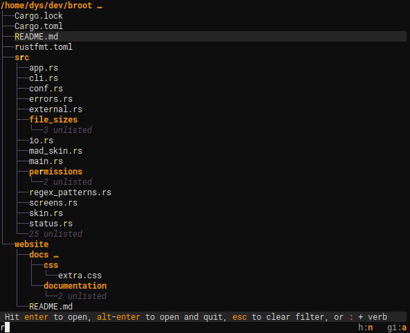
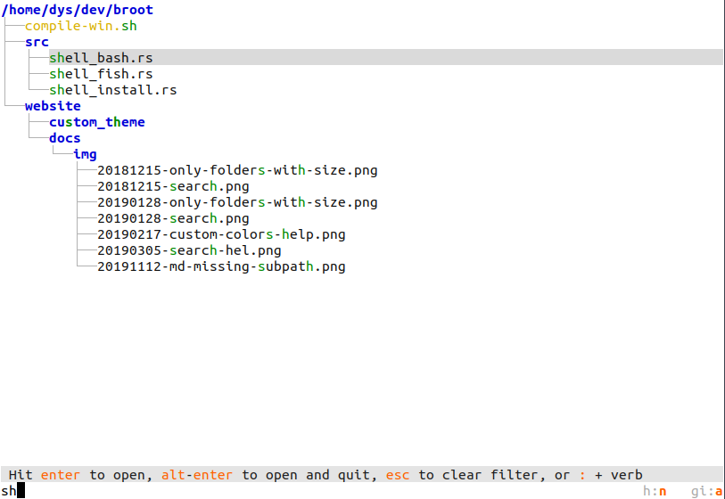

# Opening the configuration file

The configuration file location follows the XDG convention and its location depends on your OS.

The easiest way to read and edit broot's configuration file is to go the help screen (using <kbd>?</kbd>) then to type `:os` (shorcut for `:open_stay`).

This file is called `conf.toml` and is in [TOML](https://github.com/toml-lang/toml).

Currently, you can configure

* verbs
* colors

# Verbs, Shortcuts, and keys

## Verb Definition Attributes

You can define a new verb in the TOML configuration file with a `[[verbs]]` section similar to this one:

	[[verbs]]
	invocation = "edit"
	key = "F2"
	shortcut = "e"
	execution = "/usr/bin/nvim {file}"

The possible attributes are:

name | mandatory | role
-|-|-
invocation | no | how the verb is called by the user, with placeholders for arguments
execution | yes | how the verb is executed
key | no | a keyboard key triggerring execution
shorcut | no | an alternate way to call the verb (without the arguments part)
leave_broot | no | whether to quit broot on execution (default: `true`)
from_shell | no | whether the verb must be executed from the parent shell (needs `br`, default: `false`)

## Shortcuts and Verb search

**broot** looks for the first token following a space or `:` and tries to find the verb you want.

* If what you typed is exactly the shorcut or name of a verb, then this verb is selected: broot explains you what it would do if you were to type `enter`
* If there's exactly one verb whose name or shortcut starts with the characters you typed, then it's selected
* if there are several verbs whose name or shortcut start with the characters you typed, then broot waits for more
* if no verb has a name or shortcut starting with those characters, broot tells you there's a problem

Knowing this algorithm, you may understand the point in the following definition:

	[[verbs]]
	invocation = "p"
	execution = ":parent"

This verb is an alias to the internal builtin already available if you type `:parent`.

Its interest is that if you do `:p`, then `enter`, it is executed even while there are other verbs whose invocation pattern starts with a `p`.

Use shortcuts for verbs you frequently use.

## Keyboard key

The main keys you can use are

* The function keys (for example `"F3"`)
* Ctrl and Alt keys (for example `"^T"` `"alt-a"`)

It's possible to define a verb just to add a trigger key to an internal verb.

For example you could add those mappings:

	[[verbs]]
	invocation = "root"
	key = "F9"
	execution = ":focus_root"

	[[verbs]]
	invocation = "home"
	key = "ctrl-H"
	execution = ":focus_user_home"

	[[verbs]]
	key = "alt-j"
	execution = ":line_down"

	[[verbs]]
	invocation = "top"
	key = "F6"
	execution = ":select_first"

	[[verbs]]
	invocation = "bottom"
	key = "F7"
	execution = ":select_last"

	[[verbs]]
	invocation = "open"
	key = "crtl-O"
	execution = ":open_stay"

	[[verbs]]
	invocation = "edit"
	key = "F2"
	shortcut = "e"
	execution = "$EDITOR {file}"
	from_shell = true

Then,

* when doing <kbd>alt</kbd><kbd>J<kbd>, you would move the selection down (notice we don't need an invocation)
* when doing <kbd>Ctrl-H</kbd>, you would go to you user home (`~` when on linux),
* you would open files (without closing broot) with <kbd>ctrl-O</kbd>,
* <kbd>F7</kbd> would select the last line of the tree,
* and you'd switch to your favorite editor with <kbd>F2</kbd>

Beware that consoles intercept some possible keys. Many keyboard shortcuts aren't available, depending on your configuration.

### Verbs not leaving broot

If you set `leave_broot = false`, broot won't quit when executing your command, but it will update the tree.

This is useful for commands modifying the tree (like creating or moving files).

There's currently a  limitation: terminal based programs don't properly run if broot isn't closed before. It means you can't for example set `leave_broot = false` in verbs launching `vi` or `emacs`.

## Verb Arguments

The execution of a verb can take one or several arguments.

For example it may be defined as `/usr/bin/vi {file}̀ .

Some arguments are predefined in broot and depends on the current selection:

name | expanded to
-|-
`{file}` | the complete path of the current selection
`{parent}` | the complete path of the current selection's parent
`{directory}` | the closest directory, either `{file}` or `{parent}`

!!!	Note
	when you're in the help screen, `{file}` is the configuration file, while `{directory}` is the configuration directory.

But you may also define some arguments in the invocation pattern. For example:

	[[verbs]]
	invocation = "mkdir {subpath}"
	execution = "/bin/mkdir -p {directory}/{subpath}"

(this one has now been made standard so you don't have to write it in the configuration file)

In this case the subpath is read from what you type:

As you see, there's a space in this path, but it works. **broot** tries to determine when to wrap path in quotes and when to escape so that such a command correctly works.

It also normalizes the paths it finds which eases the use of relative paths:

Here's another example, where the invocation pattern defines two arguments by destructuring:

	[[verbs]]
	invocation = "blop {name}\\.{type}"
	execution = "/bin/mkdir {parent}/{type} && /usr/bin/nvim {parent}/{type}/{name}.{type}"
	from_shell = true

And here's how it would look like:

Notice the `\\.` ? That's because the invocation pattern is interpreted as a regular expression
(with just a shortcut for the easy case, enabling `{name}`).
The whole regular expression syntax may be useful for more complex rules.
Let's say we don't want the type to contain dots, then we do this:

	[[verbs]]
	invocation = "blop {name}\\.(?P<type>[^.]+)"
	execution = "/bin/mkdir {parent}/{type} && /usr/bin/nvim {parent}/{type}/{name}.{type}"
	from_shell = true

You can override the default behavior of broot by giving your verb the same shortcut or invocation than a default one.

## Built In Verbs

Here's the list of actions you can add an alternate shortcut or keyboard key for:

invocation | default key | default shortcut | behavior / details
-|-|-|-
:back | <kbd>Esc</kbd> | - | back to previous app state (see Usage page) |
:cd | <kbd>alt</kbd><kbd>enter</kbd> | - | leave broot and cd to the selected directory (needs the br shell function)
:cp {newpath} | - | - | copy the file or directory to the provided name
:help | <kbd>F1</kbd> | - | open the help page. Help page can also be open with <kbd>?</kbd>
:focus | <kbd>enter</kbd> | - | set the selected directory the root of the displayed tree |
:focus_user_home | - | - | focus the user's home (`~` on linux) |
:focus_root | - | - | focus the root directory (`/` on linux)
:line_down | <kbd>↓</kbd> | - | scroll one line down or select the next line
:line_up | <kbd>↑</kbd> | - | scroll one line up or select the previous line
:mkdir {subpath} | - | md | create a directory
:mv {newpath} | - | - | move the file or directory to the provided path
:open_stay | <kbd>enter</kbd> | - | open the selected file in the default OS opener
:open_leave | <kbd>alt</kbd><kbd>enter</kbd> | - | open the selected file in the default OS opener and leaves broot
:page_down | <kbd>⇟</kbd> | - | scroll one page down
:page_up | <kbd>⇞</kbd> | - | scroll one page up
:parent | - | - | focus the parent directory
:print_path | - | pp | print path and leaves broot
:print_tree | - | pt | print tree and leaves broot
:quit | <kbd>ctrl</kbd><kbd>q</kbd> | q | quit broot
:refresh | <kbd>F5</kbd> | - | refresh the displayed tree and clears the directory sizes cache
:rm | - | - | remove the selected file or directory. To stay safe, don't define a keyboard key for this action
:select_first | - | - | select the firt line
:select_last | - | - | select the last line
:toggle_dates | - | - | toggle display of last modified dates
:toggle_files | - | - | toggle showing files (or just folders)
:toggle_git_ignore | - | - | toggle git hignore handling (auto, no or yes)
:toggle_hidden | - | - | toggle display of hidden files (the ones whose name starts with a dot on linux)
:toggle_perm | - | - | toggle display of permissions (not available on Windows)
:toggle_sizes | - | - | toggle the size mode
:toggle_trim_root | - | - | toggle trimming of top level files in tree display

Note that

- you can always call a verb with its default invocation, you don't *have* to define a shortcut
- verbs whose invocation needs an argument (like `{newpath}`) can't be triggered with just a keyboard key.
- many keyboard keys should be kept available for the input

# Colors

## Skin configuration

You can change all colors by adding a `[skin]` section in your `conf.toml` file.

For example:

	[skin]
	default = "gray(22) gray(1)"
	tree = "rgb(89, 73, 101) none"
	file = "gray(21) none"
	directory = "rgb(255, 152, 0) none bold"
	exe = "rgb(17, 164, 181) none"
	link = "Magenta none"
	pruning = "rgb(89, 73, 101) none Italic"
	permissions = "gray(12) none "
	selected_line = "none gray(3)"
	char_match = "yellow none"
	file_error = "Red none"
	flag_label = "gray(16) none"
	flag_value = "rgb(255, 152, 0) none bold"
	input = "White none"
	status_error = "Red gray(2)"
	status_job = "ansi(220) gray(5)"
	status_normal = "gray(20) gray(3)"
	status_italic = "rgb(255, 152, 0) None"
	status_bold = "rgb(255, 152, 0) None bold"
	status_code = "ansi(229) gray(5)"
	status_ellipsis = "gray(19) gray(1)"
	scrollbar_track = "rgb(80, 50, 0) none"
	scrollbar_thumb = "rgb(255, 187, 0) none"
	help_paragraph = "gray(20) none"
	help_bold = "rgb(255, 187, 0) none bold"
	help_italic = "Magenta rgb(30, 30, 40) italic"
	help_code = "gray(21) gray(3)"
	help_headers = "rgb(255, 187, 0) none"

which would look like this:

Each skin entry value is made of

* a foreground color
* a background color (or `none`)
* zero, one, or more *attributes*

A color can be

* `none`
* an [Ansi value](https://en.wikipedia.org/wiki/ANSI_escape_code), for example `ansi(160)`
* a grayscale value, with a level between 0 and 23, for example `grey(3)`
* a RGB color, for example `rgb(255, 187, 0)`

Beware that many terminals aren't compatible with RGB 24 bits colors (or aren't usually configured for).

Currently supported attributes are:

* bold
* italic
* crossedout
* underlined
* overlined

Note that some of them may be ignored by your terminal. Windows supports about none of them, for example.

## White background skin

If you're used to black on white, you might prefer to use a white background skin:

	[skin]
	default = "gray(2) gray(23)"
	tree = "gray(17) none"
	file = "gray(1) none"
	directory = "ansi(20) none bold"
	exe = "ansi(178) none"
	link = "Magenta none"
	pruning = "gray(5) none Italic"
	permissions = "gray(4) none "
	selected_line = "none gray(20)"
	char_match = "ansi(28) none"
	file_error = "Red none"
	flag_label = "gray(16) none"
	flag_value = "ansi(202) none bold"
	input = "ansi(0) none"
	status_error = "ansi(196) gray(22)"
	status_job = "ansi(220) gray(18)"
	status_normal = "gray(2) gray(22)"
	status_italic = "ansi(202) gray(22)"
	status_bold = "ansi(202) gray(22) bold"
	status_code = "ansi(17) gray(22)"
	status_ellipsis = "gray(1) white"
	scrollbar_track = "gray(20) none"
	scrollbar_thumb = "ansi(238) none"
	help_paragraph = "gray(2) none"
	help_bold = "ansi(202) none bold"
	help_italic = "ansi(202) none italic"
	help_code = "gray(5) gray(22)"
	help_headers = "ansi(202) none"

(don't hesitate to contact me or to do a PR if you have a better skin to propose)

