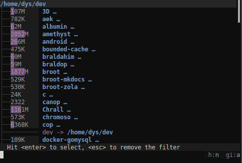
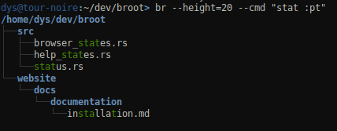

# Launch Broot

When the installation is [complete](installation.md##installation-completion-the-br-shell-function), you may start broot with either

	broot

or

	br

If your shell is compatible, you should prefer `br` which enables some features like `cd` from broot.

You can pass as argument the path you want to see, for example

	br ~

# Navigate

## Basics

When you start broot, the current directory is displayed, with most often some directories open and some lines truncated, in order to fit the available height.

The first line is called the root, and is currently selected.

From here you may navigate using the following keys:

* <kbd class=b>↓</kbd> or <kbd class=b>↑</kbd> : select the next or previous line
* <kbd class=b>⏎</kbd> on a simple file : leave broot and open the file using xdg-open
* <kbd class=b>⏎</kbd> on a directory : focus the directory (i.e. make it the new root)
* <kbd>esc</kbd> gets you back to the previous state (or leave broot if there's none)
* <kbd>F5</kbd> refreshes the page
* <kbd>alt</kbd> + <kbd class=b>⏎</kbd> on a directory : leave broot and `cd` the shell to that directory.
* <kbd>?</kbd> brings you to the help screen

There are also a few more shortcuts:

* moving one page up can be done with <kbd>Ctrl</kbd> <kbd>u</kbd>
* moving one page down can be done with <kbd>Ctrl</kbd> <kbd>d</kbd>
* you can quit with <kbd>Ctrl</kbd> <kbd>q</kbd>

## Fuzzy Patterns

You would usually not just navigate this way: you'll filter the tree.

This is done simply by typing a few letters.

The pattern filters the tree while you type. It's interpreted in a fuzzy way so that you don't have to type all the letters or even consecutive letters. The best match is automatically selected.

For example:

Hitting <kbd>esc</kbd> clears the current pattern.

## Regular Expressions

If there's a `/` before or after the patten, it's interpreted as a regular expression.

For example `/pat+ern` would match `"patern.zip"` or `"some_patttern.rar"` but not `"pATTern"`.

If you want the regex to be case insensitive, add the `i` flag: `pat+ern/i`.

## Flags

Flags are displayed at the bottom right, showing the settings regarding hidden files and .gitignore rules.

## Toggles

Initially, broot doesn't show files whose name starts with a dot, or files declared as ignored by a `.gitignore` file. Permissions and file sizes aren't shown.

This behavior is tuned with several toggles.

 | name              | shortcut | description
 |-------------------|----------|--------------------------------------------------
 | toggle_files      | files    | toggle showing files (or just folders)
 | toggle_git_ignore | gi       | toggle use of .gitignore
 | toggle_hidden     | h        | toggle showing hidden files
 | toggle_perm       | perm     | toggle showing file permissions
 | toggle_sizes      | sizes    | toggle showing sizes
 | toggle_trim_root  | t        | toggle removing nodes at first level too (default)

To apply one, just type a space (or `:`), then the start of its shortcut, then hit <kbd class=b>⏎</kbd>.

For example typing `:s` then enter will show directory sizes:

You may notice a scrollbar on this screenshot.
You may sometimes want to *not* trim the first level of the tree, which is done by using the `toggle_trim_root` (and which is also automatically done when displaying sizes).

## gitignore

The gitignore "toggle" has 3 modes:

mode | display | filtering
-|-|-
no | `gi:n` | .gitignore files aren't applied
yes | `gi:y` | .gitignore rules are applied whenever they're found. If the root contains several git projects, it means different visible subtrees follow different sets of rules
auto| `gi:a` | if the current root is a git directory or inside one, then the rules are applied. Otherwise they aren't

## Quitting broot

Other than executing a command leaving broot, there are several ways to quit:

* if the current root is selected, just hit `enter`
* hit <kbd>ctrl</kbd>+<kbd>Q</kbd>
* type `:q` or ` q` then `enter`

# Verbs & Command

When you used a toggle, you executed a command in it simplest form: without argument and independant from the current selection.

The simplest verbs are just executed by typing a space (or `:`), then its first letters, then enter.

A verb can be related to the current selection. For example typing `:p` will execute the `:parent` verb, which focuses the parent of the selection (*focusing* means taking the selected directory and making it the current root).

## Verbs using the selection

The `rm` verb executes the standard `rm` command.

It's defined by this couple (invocation, execution):

	invocation = "rm"
	execution = "/bin/rm -rf {file}"

When you type a verb, the execution pattern is completed using the selection (`{file}`), the exact command is displayed in the status line:

As for filters, hitting <kbd>esc</kbd> clears the command.

Selection based arguments:

name | expanded to
-|-
`{file}` | the complete path of the current selection
`{parent}` | the complete path of the current selection's parent
`{directory}` | the closest directory, either `{file}` or `{parent}`

## Verbs using arguments

Some commands not only use the selection but also takes one or several argument(s).

For example mkdir is defined as

	invocation = "mkdir {subpath}"
	execution = "/bin/mkdir -p {directory}/{subpath}"

which means that if you type `c/d`, and the file `/a/b/some_file.rs` is selected, then the created directory would be `a/b/c/d`.

Example:

In this screenshot, we didn't type `mkdir` or its start but `md`. That's because the complete definition of this verb includes this line:

	shortcut = "md"

!!!	Note
	The help screen lists the whole set of available verbs, including the ones coming from the configuration.

## Builtins & external commands, leaving or not

There are two types of verbs, differing by their *execution* pattern (which will be covered in more details in the [configuration page](configuration.md#verbs)):

* buitin features, whose execution starts with `:`, apply internal functions, for example `:toggle_perm` to trigger computation and display of unix file permissions
* external commands, whose execution implies calling an external program, for example `rm -rf {file}`

A command may leave broot (for example to start a program), or not (the tree will be refreshed).

## Most common Commands

!!!	Note
	Remember that you may select a verb by just typing the first letters of its name or shorcut

### Navigation

Command | Shortcut | Usage
-|-|-
back| | revert to the previous state (mapped to `esc`)
cd | | leave broot and change directory (mapped to `alt-enter`)
focus | goto | display the selected directory (mapped to `enter`)
help | ? | go to the help screen
open              |          | open file according to OS settings (mapped to  `enter` )
parent            | p        | move to the parent directory
print_path        | pp       | print path and leaves broot
quit              | q        | quit the application

### File Manipulation

Command | Shortcut | Usage
-|-|-
mkdir | md | create a new directory, using a name you provide as argument
mv | | move a file or directory, to a relative path you provide as argument
rm |  | remove the selected file or directory

## Adding verbs

You may start with the common set of verbs but you'll very quickly want to define how to edit or create files, and probably have a few personal commands.

That's why should see [how to configure verbs](configuration.md#verbs).

# Launch Arguments

**broot** and **br** can be passed as argument the path to display.

They also accept a few other arguments which you can view with `br --help`.

Most of them are display toggles, which may be useful when aliasing the function but which are accessible from inside the application anyway.

Some of them are a little special, though, and are explained below:

## the `--outcmd` launch argument

Some external commands can't be executed from a program.

This is especially the case of `cd`, which isn't a program but a shell function. In order to have any useful effect, it must be called from the parent shell, the one from which broot was launched, and a shell which isn't accessible from broot.

The trick to enable broot to `cd` your shell when you do `alt-enter` is the following one:

* **br** is a shell function. It creates a temp file whose path it gives as argument to **broot** using `--outcmd`
* when you do `alt-enter`, **broot** writes `cd your-selected-path` in this file, then quits
* **br** reads the file, deletes it, then evals the command

Most users have no reason to use `--outcmd` on their own, but it can still be used to write an alternative to **br** or to port it to shells which aren't currently supported.

## the `--out` launch argument

If you provide a path to broot with `--out`, then a few commands won't execute anything directly but will instead write the relevant path as a line in the given file.

This may be used by shell functions or other programs calling broot, in a similar way to `--outcmd`, for example in conjonction with ̀ --cmd`.

## the `--cmd` launch argument

This argument lets you pass commands to broot. Those commands are executed exactly like any command you would type yourself in the application, a space meaning broot must wait for the end of execution.

For example if you launch

    br --cmd cow /

Then broot is launched in the / directory and there's simply a filter typed for you.

If you do

    br --cmd "/^vache :p"

Then broot looks for a file whose name starts with "vache" and focus its parent.

If you do

    br --cmd "mucca$/ :cd"

then broot searches for a file whose name ends with "mucca", and `cd` to the closest directory, leaving you on the shell, in your new directory (you may not have the time to notice the broot guy was displayed).

The `--cmd` argument may be the basis for many of your own shell functions or programs.

!!!	Note
	Due to the way a new char cancels an in progress search, you can't pass both a search and a verb in the same command, you have to separate them with a space. That is, if you want to search for `thing` then do `:rm` on the best match (assuming you like to live dangerously), you have to do `br --cmd "thing :rm"` instead of `br --cmd "thing:rm"`.

# Export a tree

If you want to use the pruned tree out of broot (for example for a documentation), you may use the `:print_tree` verb.

It can be used in several ways.

The easiest is to just execute it from inside the application (the verb is also accessible with the `:pt` shortcut). This quits broot and you find the tree on your console, without the status line and the input, but with the same filtering state as when you were browsing.

With the `--out` command, the tree is written in a passed file. For example `br --out test.txt`.

!!!	Note
	It's not possible today to simply redirect the output of broot into a file with `>>>`.

You don't have to enter broot, you may also directly get the tree by using the [`--cmd` argument](#cmd). An additional parameter may come handy: `--height` which specifies the size of the virtual screen, which may be smaller or bigger than the real one (no problem if you want 10000 lines).

Example with a filter:

Example without style or color, thanks to `--no-style`:

This is also how would look the tree directly exported into a file.

