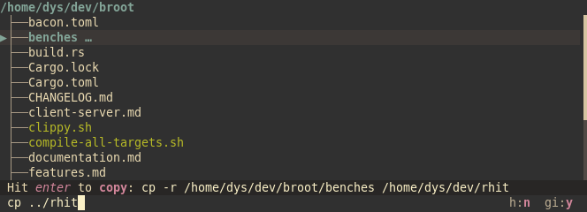
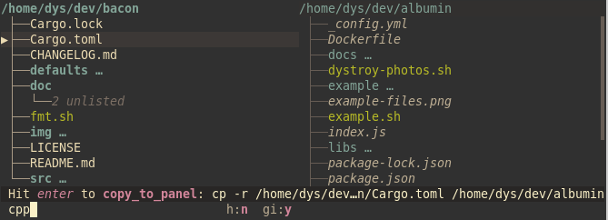
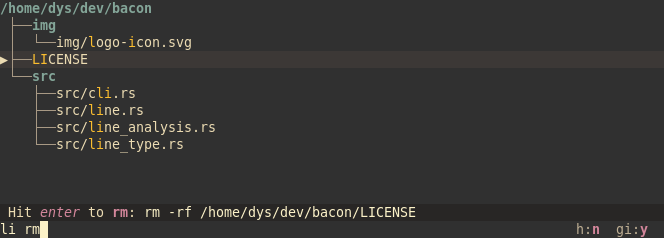
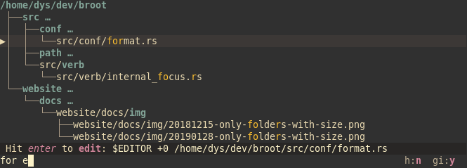
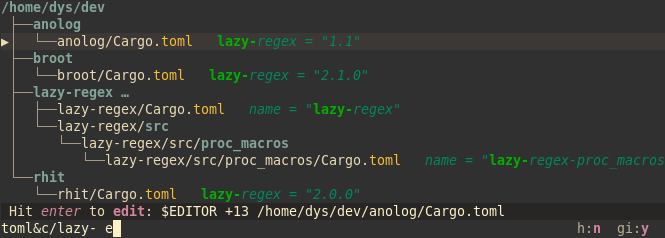
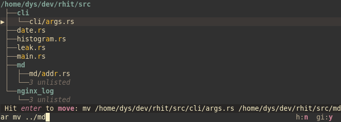
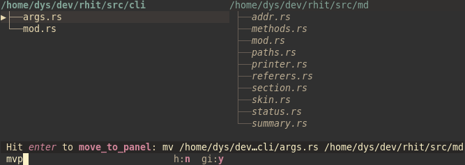

Those common file operations may be discovered elsewhere in the site, or in the help screen in Broot.

This page is a cheat sheet gathering them in one place.

It focuses on the default settings, on the basis that you change the settings only after you understood the feature.

I'll assume here you know the basics of command line file operations. Broot doesn't hide the operations, it makes them easier and faster to type and shows you immediately the result but you won't be able to do them if you don't know what a `cp` or a `mkdir` does.

For each command here, don't forget you can hit <kbd>esc</kbd> to remove it. It's the fast way to cance.

!!!	Note
	To be easier to read, this page uses `:` to start verbs but a space is equivalent and is often more convenient to type.

!!!	Note
	Most screenshots here don't feature a filtering pattern (i.e. the part before the first space or colon) but you never need to remove your filter to execute your file operation. Typing a pattern is usually the fastest way to select the file you want.

# cd

A `cd` here means changing the current directory in the shell from which broot was launched.

This is done either by hitting <kbd>alt</kbd><kbd>enter</kbd> or by issuing the `:cd` verb.

It needs broot to be launched with the [`br` shell function](../install-br).

# chmod

This operation only exists on unix-like systems.

The built in `chmod` command takes as argument the mode modifier.

For example, to make the selected file executable, you type `:ch` then a space or tab, then `+x`.

After having checked the status line, you hit enter and the modification is done.

When you're not sure about the current mode, you may show them before starting the operation. This is done either

- by starting broot with the `-p` command line argument
- by hitting `:perm` in broot

Here's how the same `chmod` operation would look like with the mode displayed:

# copy

## with one panel

Select the file or directory you want to copy, type `:cp` then a tab or a space, then the destination path.

Don't hesitate to hit the <kbd>tab</kbd> key while typing your path to get completion. Broot accepts and solves relative paths:

After having checked the status line, you hit enter and the copy is done.

## with two panels

When you do changes involving distant location, you may want to see both trees side to side. This is done by [opening two panels](../panels).

When using two panels, no argument is needed for the copy. The verb to use is `:cpp`:

As there's no argument, you may [define a key binding](../conf_verbs#keyboard-key) for cpp in your configuration if you like this operation.

# create a file

The default configuration assumes a terminal editor is defined either with the `$EDITOR` env variable or with an `editor` command in the paths. If you don't have a default terminal editor, you should edit the `create` verb in the [configuration file](../conf_file).

The desired parent being selected, type `:cr` then hit <kbd>tab</kbd> or a space, then the name of the new file:

On <kbd>enter</kbd> you'll enter your favourite text editor and you'll be back to broot when quitting it.

# create a directory

Select the desired parent, type `:md` then hit a space or a tab, then enter the name of the new directory and hit <kbd>enter</kbd>.

You may type several slash separated elements as the command will contain the `-p` flag:

# delete

## the selected file or directory

Select a file, type `:rm`

Check the status line then hit <kbd>enter</kbd>:

## with staging

Let's assume you want to remove a lot of files and directories because your disk is full.

In such a case, you start broot in "whale hunt" mode, with `br -w` to have files and directories sorted by size.

Instead of removing files one per one, you may want to "stage" them, that is to add them to the staging area where they're counted, summed, and where you'll remove them in one operation at the end.

You stage a file (and display the staging area) with the <kbd>ctrl</kbd><kbd>g</kbd> shortcut:

The total size of the staging area is displayed on top (here "8.1G").

(when not doing screenshots for a website, I suggest you use a bigger console, so it's less crowded, but as you see broot stays usable in a tiny one)

When you ready to remove everything, you go to the staging area with <kbd>ctrl</kbd><kbd>right</kbd> then type `:rm`:

You finish by hitting <kbd>enter</kbd>.

# edit a text file

The default configuration assumes a terminal editor is defined in your system. If it isn't and you can't set it, you should edit the `edit` verb in the [configuration file](../conf_file).

Select the file you want to edit, type `:e` then hit <kbd>enter</kbd>.

As there's no argument, you may [define a key binding](../conf_verbs#keyboard-key).

You may have noticed the `+0`. If you're in a preview on a specific line, or you [searched on file content](../navigation#file-content-searches), the file may be directly open on that line with this standard argument :

Here, on <kbd>enter</kbd>,  we'd go to line 13 where is the first occurrence of "lazy-" in this file.

(you may change the configuration if your editor has a different syntax)

# move

*Note that there's also a [rename](#rename) which is usually better if you only want to change the name.*

## with one panel

Select the file or directory you want to copy, type `:mv` then a tab or a space, then the destination path.

Don't hesitate to hit the <kbd>tab</kbd> key while typing your path to get completion. Broot accepts and solves relative paths:

After having checked the status line, you hit enter and the copy is done.

## with two panels

When you do changes involving distant location, you may want to see both trees side to side. This is done by [opening two panels](../panels).

When using two panels, no argument is needed for the copy. The verb to use is `:mvp`:

As there's no argument, you may [define a key binding](../conf_verbs#keyboard-key) for mvp in your configuration if you like this operation.

# open

When a file (not a directory) is selected and you hit <kbd>enter</kbd>, the `:open_stay` internal is executed, which calls the standard file opening solution of your system and doesn't close Broot. For example on a desktop linux, this calls a variant of xdg-open which in turns will choose an application using the file's extension.

When your system doesn't know how to open files (for example on server linux with no windowing solution), this may be a problem and you can [change this behavior](../tricks#change-standard-file-opening).

# rename

If all you want is to change part of the name of a file, perhaps its extension, the `:rename` verb is ideal.

It's mapped by default to <kbd>F2</kbd>.

Just hitting the trigger key prefills the input with the command with the name as argument.

You only have to edit this name then hit <kbd>enter</kbd>.

