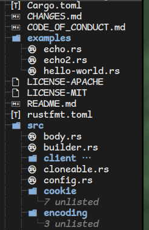

# Icons



## Caveats

This is a preview feature, and the author might change the font mappings based on feedback from users. That said, if you are using pre-packaged broot, then this shouldn't be a problem.

Before we begin talking about icons, to save the user time in debugging, it's important to realize that broot doesn't directly interact with the icon display, it only prints a character (say 65 for 'A'). It's the terminal that renders that into a shape. Thus, if you see any problems with this feature, it's going to be with your environment. See the debugging section later on how to debug issues.

## Setup

### Setting up font

If you are using pre-packaged broot, then you shoulnd't need any setup for fonts. The package should install the font correctly and your terminal should fall back to using its glyphs. 

If you are compiling from source, inside `resources` directory, find the `ttf` corresponding to your desired theme (currently only `vscode` is available). Install that `ttf` to your system fonts. For linux, copy to ~/.local/share/fonts. For windows, double click to open and click on "Install font". 

### Setting up your broot config

In broot's [config file](../conf_file), add a line `icon_theme="vscode"` before the `[[verbs]]` section.

## Debugging

The first thing to check is typing the following command in bash/zsh on your system: `echo -e "file_type_rust looks like \U001002D2"`. (For windwos


To test whether your environment is setup correctly, type the  following command in zsh/bash.

```bash
echo -e "file_type_rust looks like \U001002D2"
```

For powershell, try 

```powershell
echo "Rust is `u{1002D2}"
```

If you see a rust gear icon, your terminal is displaying the correct font. 

If you still have trouble viewing icons in `broot`, one cause could be your config. Try putting the `icon_theme` section at the beginning of config file. 


## FAQ

Q: I don't see icons for my favourite common file type. 
A: This is a work in progress, you can help out 


Q: Why isn't the icon mapping configurable?
A: For performance reasons, icon mapping is hardcoded, to save time in parsing the icon file. The icon plugin API can easily support this, consider submitting a PR.

Q: Why does broot show a generic icon for this very common file type?
A: The icon mappings aren't complete. You can help out very easily without any coding knowledge. Go to the github [repository](https://github.com/Canop/broot/tree/master/resources/icons). Enter the directory corresponding to your theme. Inside `data`, edit `extension_to_icon_name_map.rs` and add a line corresponding to your extension. The first field would be the extensions you would like, and the second field should be reffered from `icon_name_to_icon_code_point_map.rs`. Submit a PR.

# Other

Don't hesitate to contact me on [Miaou](https://miaou.dystroy.org/3490)

