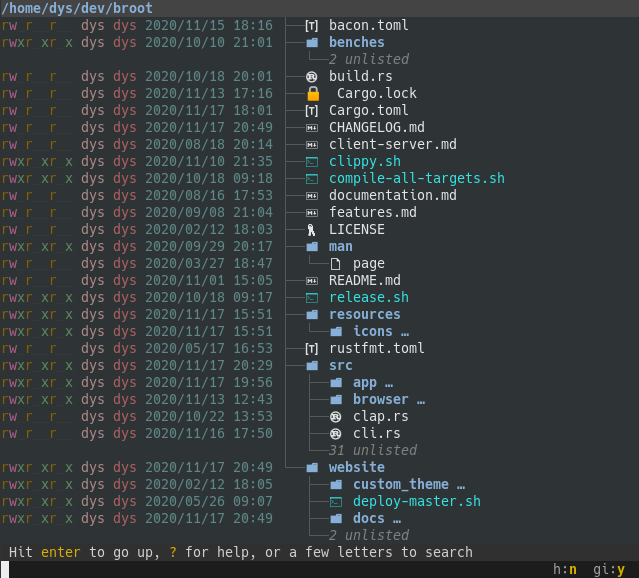

# Icons

You may configure broot to display icons:



## Checking the font

This feature needs the vscode font to be installed and available on your system.

It's possible the font was installed with broot's package, depending on the chosen package.

Here's how you can check its presence:

### Bash (and compatible):
```bash
echo -e "file_type_rust looks like \U001002D2"
```

### powershell

```powershell
echo "Rust is `u{1002D2}"
```
If you see a rust gear icon, your terminal is displaying the correct font.

## Setting up the font

If the font isn't installed, you may

* take it in `/resources/icons/vscode/vscode.ttf` if you have broot sources
* download it from [https://github.com/Canop/broot/blob/main/resources/icons/vscode/vscode.ttf](https://github.com/Canop/broot/blob/main/resources/icons/vscode/vscode.ttf),
* or take it in the release archive if you installed broot from its zipped archive.

### Installation on linux:

Copy the `vscode.ttf` file to `~/.local/share/fonts`.

### Installation on Windows

Double click  the `vscode.ttf` file icon and click on "Install font".

## Setting up your broot config

In broot's [config file](../conf_file), add or uncomment the `icon_theme = "vscode"` line (it won't work if it's after the verbs or skin in the toml file).


## FAQ

**Q:** I don't see icons for my favourite common file type.

**A:** This is a work in progress, you can help out


**Q:** Why isn't the icon mapping configurable?

**A:** For performance reasons, icon mapping is hardcoded. If this looks like a problem, please come and chat with us.


**Q:** Why does broot show a generic icon for this very common file type?

**A:** The icon mappings aren't complete. You can help out very easily without any coding knowledge. Go to the github [repository](https://github.com/Canop/broot/tree/main/resources/icons). Enter the directory corresponding to your theme. Inside `data`, edit `extension_to_icon_name_map.rs` and add a line corresponding to your extension. The first field would be the extensions you would like, and the second field should be referred from `icon_name_to_icon_code_point_map.rs`. Submit a PR.


**Q:** Can I set up a totally different set of icons or mappings ?

**A:** Broot can be configured for a different mapping or a different font, but this needs some coding and a new compilation.
To get started, have a look at look at the `resources/icons` directory and, if necessary, come and chat on miaou.
