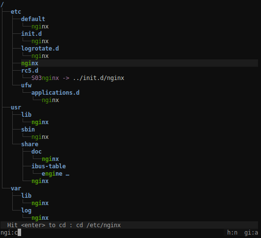

# Get an overview of a directory, even a big one

Notice the "unlisted"? That's what makes it usable where the old `tree` command would produce pages of output.

`.gitignore` files are properly dealt with to put unwanted files out of your way (you can ignore them though, see documentation).

# Find a directory then `cd` to it

This way, you can navigate to a directory with the minimum amount of keystrokes, even if you don't exactly remember where it is.

broot is fast and never blocks, even when you make it search a big slow disk (any keystroke interrupts the current search to start the next one).

Most useful keys for this:

* the letters of what you're looking for
* `<enter>` to select a directory (staying in broot)
* `<esc>` to get back to the previous state or clear your search
* `<alt><enter>` to get back to the shell having `cd` to the selected directory
* `:q` if you just want to quit (`<esc>` works too)

# Never lose track of file hierarchy while you search

broot tries to select the most relevant file. You can still go from one match to another one using `<tab>` or arrow keys.

You may also search with a regular expression. To do this, add a `/` before or after the pattern.

# See what takes space

To toggle size display, type `:s`. Sizes are computed in the background, you don't have to wait for them when you navigate.

# Apply a personal shortcut to a file

Just find the file you want to edit with a few keystrokes, type `:e`, then `<enter>` (you should define your preferred editor, see [documentation](documentation/usage.md#verbs)).

# More...

See the complete [Documentation](documentation/usage.md).

