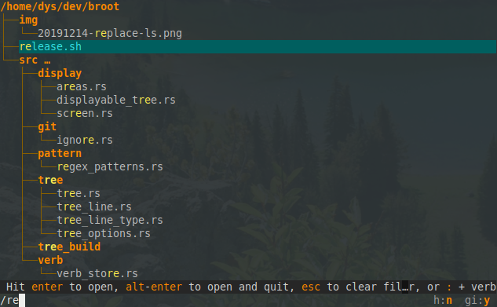
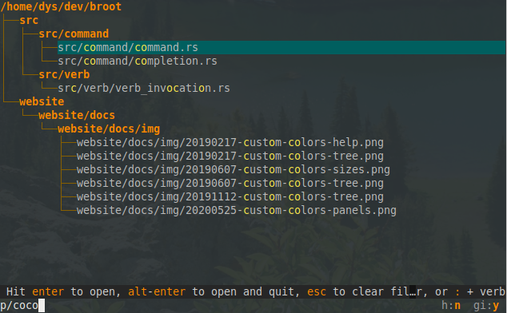
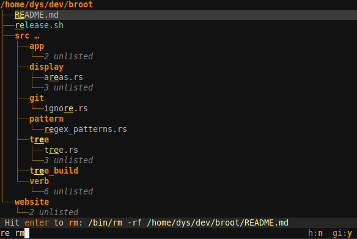
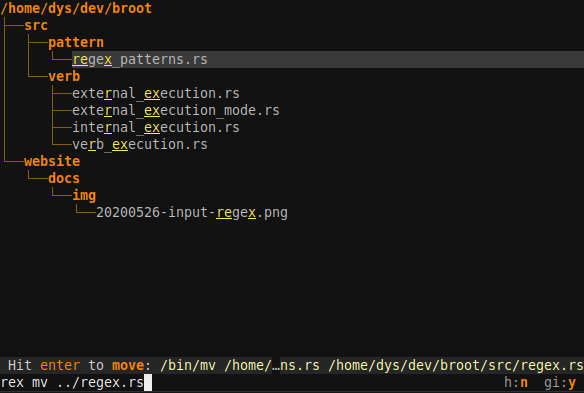
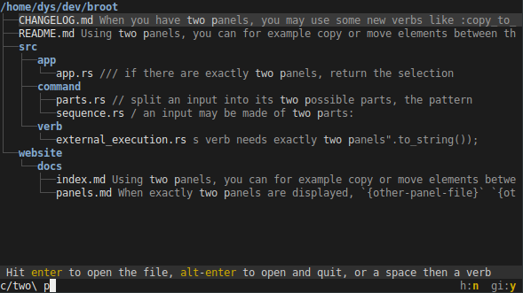
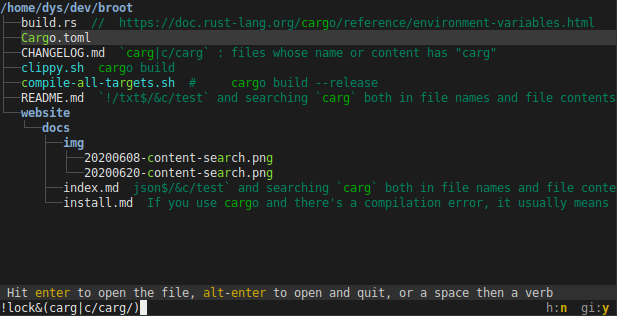

## General form

The input is the area at the bottom of the focused panel, in which you can type a filter or a command.

Its parts are

* a filtering pattern
* a verb invocation, starting with a space or a colon (`:`)

Both parts are optional.

## The filtering pattern

A search pattern is made of 1 to 3 parts separated by the `/` character but you rarely need the two `/`.

The syntax is globally

    <mode><pattern>[/<flags>]

The mode is either nothing (fuzzy name), just a slash (regex name) or some letters followed by a slash.

mode | example query | example match | explanation
-|-|-|-
fuzzy name | `abc` or `nf/abc` | `abac.txt` | search for "abc" in a fuzzy way in filenames
exact name | `e/Bac` or `en/Bac` | `ABac.txt` | search for the string "Bac" in filenames
regex name | `/[yz]{3}` or `/[yz]{3}/` | `fuzzy.rs` | search for the regular expression `[yz]{3}` in filenames
regex name | `/(json|xml)$/i` | `thing.XML` | find files whose name ends in `json` or `xml`, case insensitive
regex name | `/abc/i` | `aBc.txt` | search for the regular expression `abc` with flag `i` in filenames
fuzzy path | `p/abc`  or `p/abc/` | `a/bac.txt` |  search for "abc" in a fuzzy way in sub-paths from current tree root
exact path | `ep/te\/d`  or `pe/te\/d/` | `website/docs` |  search for "te/d" in sub-paths from current tree root
regex path | `rp/\\d{3}.*txt` | `dir/a256/abc.txt` |  search for the `\d{3}.*txt` regex  in sub-paths from current tree root
exact content | `c/mask` or `c/mask/` | `umask = "1.0"` | search for the "mask" string in file contents
regex content | `rc/[abc]{5}/i` | `bAAAc` | search with a regular expression in file contents - `i` making it case insensitive

It's also possible to [redefine those mode mappings](../conf_file/#search-modes).

To escape characters (for example the space, colon or slash) in the pattern, use a `\` (an antislash is `\\`).

## Combining filtering patterns

Patterns can be combined with the `!` (not), `&` (and) and `|` (or) operators, and parentheses if necessary.

You can for example display non `json` files containing either `isize` or `i32` with

    !/json$/&(c/isize/|c/i32/)

### Subtleties

The characters you use as operators and the parenthesis can be useful in patterns too, either because you want to search for them in fuzzy patterns or in file contents, or because you write non trivial regular expressions.

Most often you'll just type what feels natural and broot will select the interpretation which makes sense but you might be interested in a few rules:

* parenthesis and operators in the second pattern part (parts being separated by `/`) are part of the pattern, which explains why `/(json|xml)` is interpreted as a regular expression. If you want to do a fuzzy search for a `|` in the name of your files, you'll need to either escape it as `\|` or to have an explicit pattern mode : `nf/a|b` because `a|b` would search for files whose name contains either `a` or `b`. And to ensure an operator or closing parenthesis isn't interpreted as part of your pattern, close it with a `/`.
* broot interprets the left operand before the right one and doesn't interpret the second one if it's not necessary. So if you want to search your whole disk for json files containing `abcd`, it will be faster to use `/json$/&c/abcd` rather than `c/abcd/&/json$/` which would look at the file name only after having scanned the content.

## The verb invocation

The verb invocation is

    :<verb><arguments>

or

    <space><verb><arguments>

where arguments can be empty, depending on the verb's behaviour and invocation pattern.

Verbs are detailed in the [Verbs & Commands](verbs.md) chapter.

## Examples

### A Fuzzy search:

`re`

### A regular expression based search:

`/re`

### A fuzzy path search

`p/coco`

### A search followed by a command without arguments:

`re rm` (which is equivalent to `re:rm`)

This is very natural: You use the search to select your element and you don't need to remove it before typing the command.

### A search followed by a command taking an argument:

`re mv ../regex.rs`

### A full text search

In this case with an escaped space:

`c/two\ p`

### A regular expression based full text search

### A complex composite search

Here we search for `"carg"` both in file names and file contents, and we exclude `"lock"` files:

`!lock&(carg|c/carg/)`

note: the `/` at the end of `c/carg/` is necessary to tell broot that the following parenthesis isn't part of the pattern.
