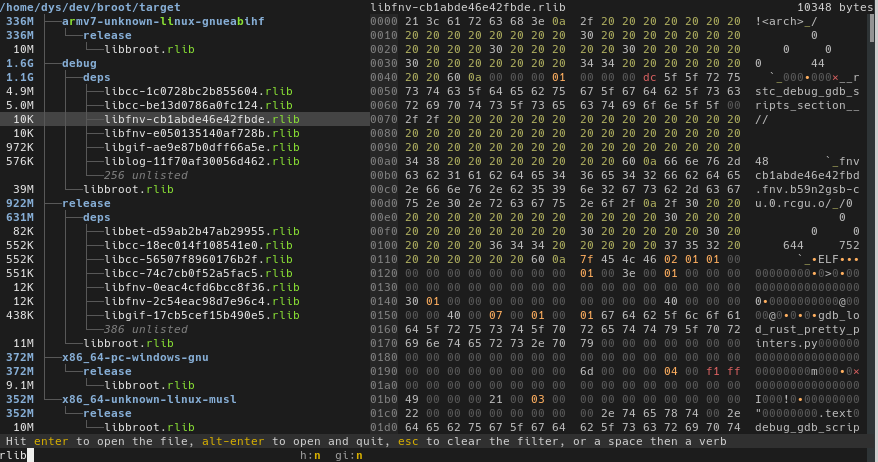
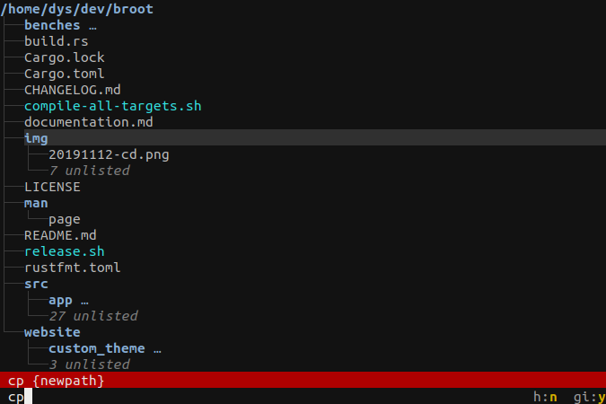
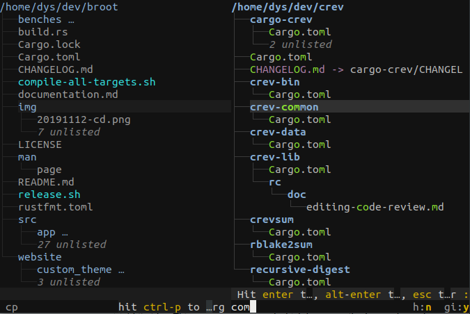
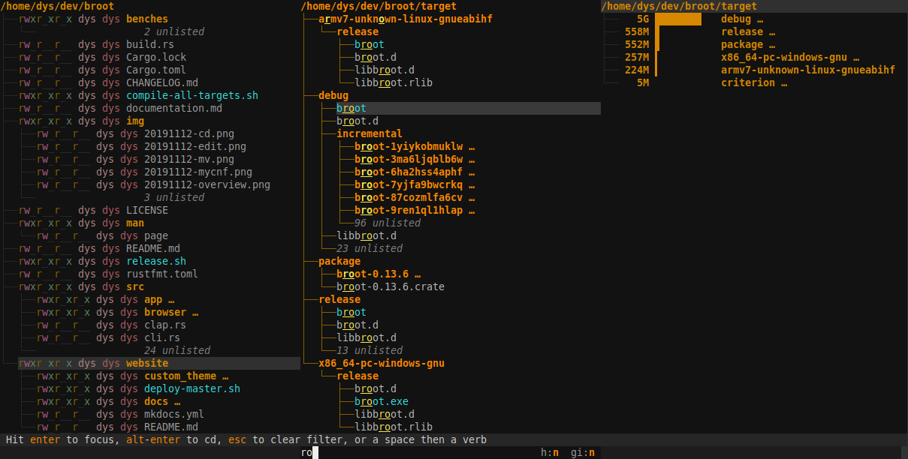

Broot can display two panels. Most frequent uses are:

* previewing files
* copying or moving files between two locations

# Keyboard shortcuts

The <kbd>ctrl</kbd><kbd>←</kbd> and <kbd>ctrl</kbd><kbd>→</kbd> shortcuts should be enough to support all common panel related operation:

* When there's only one panel, use <kbd>ctrl</kbd><kbd>←</kbd> to open a panel to the left, and <kbd>ctrl</kbd><kbd>→</kbd> to open one to the right
* When two panels are open, you may go to the panel left of the current one with <kbd>ctrl</kbd><kbd>←</kbd> and to the panel to the right with <kbd>ctrl</kbd><kbd>→</kbd>
* When two panels are open, you may close the non selected one by going the opposite direction (i.e. if you're in the left panel, you may close the right one with <kbd>ctrl</kbd><kbd>←</kbd>)

The type of open panel depends on the selection:

* If the current selection is a directory, the new panel will be a file tree
* If the current selection is a regular file, the new panel will be a preview

You may also close the current panel with <kbd>ctrl</kbd><kbd>W</kbd>, which is a shortcut for `:close_panel` (you can [change all bindings](../conf_verbs/#keyboard-key)).

!!! Note
    Depending on your system and terminal, the <kbd>ctrl</kbd><kbd>←</kbd>  and <kbd>ctrl</kbd><kbd>→</kbd> key bindings might not convenient or not usable. In such a case, you should [rebind](../conf_verbs/#keyboard-key) the `:panel_left` and `:panel_right` internals.

# Use a verb to open a panel

Another way to open a panel is to add a bang (`!`) to a verb. It tells broot to show the result in a new panel.

For example, while `:focus ~` navigates to your home directory in the current panel, you can use `:!focus ~` or `:focus! ~` to open a new panel on your home.

# The preview panel


It's not immediately focused on creation, because most often you'll want to preview a few files and it's convenient to stay in the tree to navigate.

To focus it, for example to scroll it or to do a search, do <kbd>ctrl</kbd><kbd>→</kbd> again.

Files that can't be interpreted as text or image are shown as binary:



You can search with fuzzy patterns or regular expressions inside a text preview panel:


You can go from the selected matched line to the unfiltered text, at the right place, with <kbd>ctrl</kbd><kbd>→</kbd> (and then back to the list of matching lines with <kbd>ctrl</kbd><kbd>←</kbd>).

Hopefully [this blog post](https://dystroy.org/blog/broot-c-search/) should make the complete search workflow look natural.

# Copy, move between panels... or more

When exactly two panels are displayed, `{other-panel-file}` `{other-panel-directory}`, and `{other-panel-parent}` are available for verbs.

Two built-in verbs use those arguments: `:copy_to_panel` (alias `:cpp`) and `:move_to_panel` (alias `:mvp`). By having two panels displayed you can thus copy (or move) the current panel's selection to the other one:


The default configuration file contains this that you may uncomment to add <kbd>F5</kbd> and <kbd>F6</kbd> shortcuts:


```Hjson
# {
#     key: F5
#     internal: ":copy_to_panel"
# }
# {
#     key: F6
#     internal: ":move_to_panel"
# }
```
```TOML
# [[verbs]]
# key = "F5"
# internal = ":copy_to_panel"
#
# [[verbs]]
# key = "F6"
# internal = ":move_to_panel"
```

You may define other shortcuts, or your own bi-panels verbs.

# Use a panel to edit a verb argument

Assuming you started from just one panel and wanted to execute a command taking a path as argument. You may use tab-completion to type it faster but you may also hit <kbd>ctrl</kbd><kbd>P</kbd> to create a panel and select it. Here's the complete workflow.

* Start with selecting a file and typing the verb of your choice:


* hit ctrl-p. This opens a new panel which becomes the focused panel:


* navigate to the desired destination using standard broot features:


* hit ctrl-p again, which closes the panel and updates the input in the first panel:


You may now hit enter to execute the command, maybe after having completed the path.

This workflow is based on the `:start_end_panel` verb which can be bound to another key if desired.

# More panels

The default configuration limits the number of panels to two, because most people never needs more and it makes it easier to alternate between one or two panels.

But if you want more panels, for a specific configuration of for your main one, you may change the value of `max_panels_count` in the configuration file.

If your terminal is wide enough, you may then open more panels:




