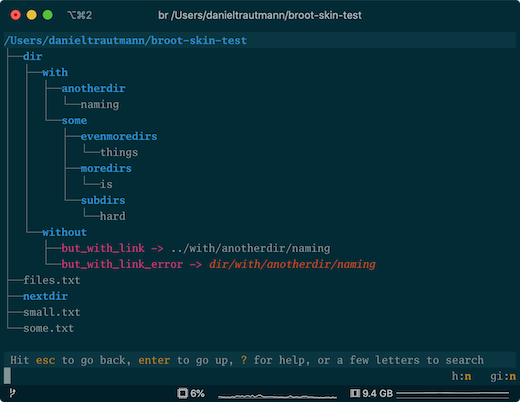
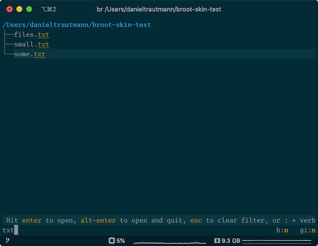
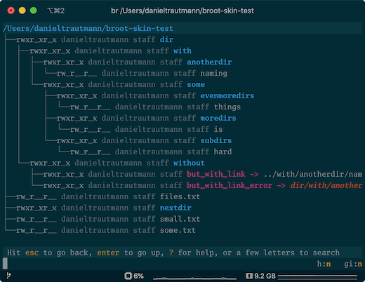
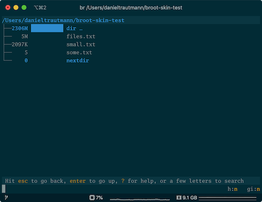
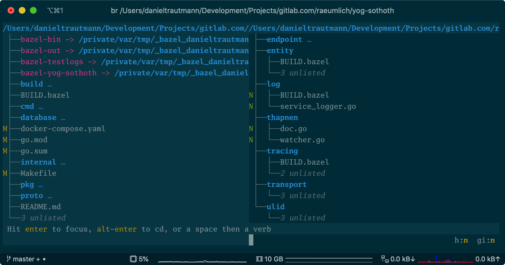

# Skin configuration

You can change all colors by adding a `[skin]` section in your `conf.toml` file.

To start with, you might want broot to use more of your terminal colors.

Try adding this in your [config file](../conf_file):

```toml
[skin]
default = "none none"
```

The first `none` sets the terminal default foreground color as broot's default one, and the second one is for the background.

Depending on your default colors, the result might be good or not.

From there, keeping or not the default colors, you may define a whole skin.

For example:

```toml
[skin]
default = "gray(23) none / gray(20) none"
tree = "ansi(94) None / gray(3) None"
file = "gray(20) None / gray(15) None"
directory = "ansi(208) None Bold / ansi(172) None bold"
exe = "Cyan None"
link = "Magenta None"
pruning = "gray(12) None Italic"
perm__ = "gray(5) None"
perm_r = "ansi(94) None"
perm_w = "ansi(132) None"
perm_x = "ansi(65) None"
owner = "ansi(138) None"
group = "ansi(131) None"
count = "ansi(136) gray(3)"
dates = "ansi(66) None"
sparse = "ansi(214) None"
content_extract = "ansi(29) None"
content_match = "ansi(34) None"
git_branch = "ansi(229) None"
git_insertions = "ansi(28) None"
git_deletions = "ansi(160) None"
git_status_current = "gray(5) None"
git_status_modified = "ansi(28) None"
git_status_new = "ansi(94) None Bold"
git_status_ignored = "gray(17) None"
git_status_conflicted = "ansi(88) None"
git_status_other = "ansi(88) None"
selected_line = "None gray(5) / None gray(4)"
char_match = "Yellow None"
file_error = "Red None"
flag_label = "gray(15) None"
flag_value = "ansi(208) None Bold"
input = "White None / gray(15) gray(2)"
status_error = "gray(22) ansi(124)"
status_job = "ansi(220) gray(5)"
status_normal = "gray(20) gray(3) / gray(2) gray(2)"
status_italic = "ansi(208) gray(3) / gray(2) gray(2)"
status_bold = "ansi(208) gray(3) Bold / gray(2) gray(2)"
status_code = "ansi(229) gray(3) / gray(2) gray(2)"
status_ellipsis = "gray(19) gray(1) / gray(2) gray(2)"
purpose_normal = "gray(20) gray(2)"
purpose_italic = "ansi(178) gray(2)"
purpose_bold = "ansi(178) gray(2) Bold"
purpose_ellipsis = "gray(20) gray(2)"
scrollbar_track = "gray(7) None / gray(4) None"
scrollbar_thumb = "gray(22) None / gray(14) None"
help_paragraph = "gray(20) None"
help_bold = "ansi(208) None Bold"
help_italic = "ansi(166) None"
help_code = "gray(21) gray(3)"
help_headers = "ansi(208) None"
help_table_border = "ansi(239) None"
preview = "gray(20) gray(1) / gray(18) gray(2)"
preview_line_number = "gray(12) gray(3)"
preview_match = "None ansi(29) Underlined"
hex_null = "gray(10) None"
hex_ascii_graphic = "gray(18) None"
hex_ascii_whitespace = "ansi(143) None"
hex_ascii_other = "ansi(215) None"
hex_non_ascii = "ansi(167) None"
```

which would look like this:


Each skin entry value is made of

* a foreground color
* a background color (or `none`)
* zero, one, or more *attributes*

This tree parts can be repeatedi, after a `/`, to define the style to use in non focused panels (when more than one panel is used).

Example:

```toml
directory = "ansi(208) None Bold / ansi(172) None"
```

A color can be

* `none`
* an [Ansi value](https://en.wikipedia.org/wiki/ANSI_escape_code), for example `ansi(160)`
* a grayscale value, with a level between 0 and 23, for example `grey(3)`
* a RGB color, for example `rgb(255, 187, 0)`

Beware that many terminals aren't compatible with RGB 24 bits colors (or aren't usually configured for).

Currently supported attributes are:

* bold
* crossedout
* italic
* overlined
* reverse
* underlined

Note that some of them may be ignored by your terminal especially if you're not on a unix system.

The mapping between keys and screen parts may not always be obvious. Don't hesitate to come ask for help on [Miaou](https://miaou.dystroy.org/3490?broot).

## Transparent background

If you want to set the background of broot transparent (i.e. to be the background of your terminal), you can set the default style like this:

```toml
default = "gray(23) none / gray(20) none"
```


# White Background Skin

This skin is suitable if you're used to black on white:

```toml
[skin]
default = "gray(1) white"
tree = "gray(7) None / gray(18) None"
file = "gray(3) None / gray(8) None"
directory = "ansi(25) None Bold / ansi(25) None"
exe = "ansi(130) None"
link = "Magenta None"
pruning = "gray(12) None Italic"
perm__ = "gray(5) None"
perm_r = "ansi(94) None"
perm_w = "ansi(132) None"
perm_x = "ansi(65) None"
owner = "ansi(138) None"
group = "ansi(131) None"
dates = "ansi(66) None"
sparse = "ansi(214) None"
git_branch = "ansi(229) None"
git_insertions = "ansi(28) None"
git_deletions = "ansi(160) None"
git_status_current = "gray(5) None"
git_status_modified = "ansi(28) None"
git_status_new = "ansi(94) None Bold"
git_status_ignored = "gray(17) None"
git_status_conflicted = "ansi(88) None"
git_status_other = "ansi(88) None"
selected_line = "None gray(19) / None gray(21)"
char_match = "ansi(22) None"
file_error = "Red None"
flag_label = "gray(9) None"
flag_value = "ansi(166) None Bold"
input = "gray(1) None / gray(4) gray(20)"
status_error = "gray(22) ansi(124)"
status_normal = "gray(2) gray(20)"
status_job = "ansi(220) gray(5)"
status_italic = "ansi(166) gray(20)"
status_bold = "ansi(166) gray(20)"
status_code = "ansi(17) gray(20)"
status_ellipsis = "gray(19) gray(15)"
purpose_normal = "gray(20) gray(2)"
purpose_italic = "ansi(178) gray(2)"
purpose_bold = "ansi(178) gray(2) Bold"
purpose_ellipsis = "gray(20) gray(2)"
scrollbar_track = "gray(20) none"
scrollbar_thumb = "ansi(238) none"
help_paragraph = "gray(2) none"
help_bold = "ansi(202) none bold"
help_italic = "ansi(202) none italic"
help_code = "gray(5) gray(22)"
help_headers = "ansi(202) none"
help_table_border = "ansi(239) None"
preview = "gray(5) gray(24) / gray(7) gray(23)"
preview_line_number = "gray(6) gray(20)"
preview_match = "None ansi(29) Underlined"
hex_null = "gray(15) None"
hex_ascii_graphic = "gray(2) None"
hex_ascii_whitespace = "ansi(143) None"
hex_ascii_other = "ansi(215) None"
hex_non_ascii = "ansi(167) None"
```


# Solarized Dark

*contributed by [@danieltrautmann](https://github.com/danieltrautmann)*

The Solarized Dark skin uses RGB values, so it might not work well with some
terminals. It was tested with iTerm2 3.3 on macOS Catalina with the reported
terminal type `xterm-256color`. This can be set via:

Profiles > Your Profile > Terminal > Reported terminal type

The comment next to each setting tells the name of the color from the Solarized
Dark color scheme. The values are taken from
[here](https://github.com/altercation/solarized#the-values). The term `default`
in the comment refers to the skins default setting.

```toml
[skin]
default = "rgb(131, 148, 150) rgb(0, 43, 54) / rgb(131, 148, 150) rgb(7, 54, 66)"  # base0 base03 / base01 base02
tree = "rgb(88, 110, 117) none"                                                    # base01 default
file = "none none"                                                                 # default default
directory = "rgb(38, 139, 210) none bold"                                          # blue default bold
exe = "rgb(211, 1, 2) none"                                                        # red default
link = "rgb(211, 54, 130) none"                                                    # magenta default
pruning = "rgb(88, 110, 117) none italic"                                          # base01 default italic
perm__ = "rgb(88, 110, 117) none"                                                  # base01 default
perm_r = "none none"                                                               # default default
perm_w = "none none"                                                               # default default
perm_x = "none none"                                                               # default default
owner = "rgb(88, 110, 117) none"                                                   # base01 default
group = "rgb(88, 110, 117) none"                                                   # base01 default
sparse = "none none"                                                               # default default
git_branch = "rgb(147, 161, 161) none"                                             # base1 default
git_insertions = "rgb(133, 153, 0) none"                                           # green default
git_deletions = "rgb(211, 1, 2) none"                                              # red default
git_status_current = "none none"                                                   # default default
git_status_modified = "rgb(181, 137, 0) none"                                      # yellow default
git_status_new = "rgb(133, 153, 0) none"                                           # green default
git_status_ignored = "rgb(88, 110, 117) none"                                      # base01 default
git_status_conflicted = "rgb(211, 1, 2) none"                                      # red default
git_status_other = "rgb(211, 1, 2) none"                                           # red default
selected_line = "none rgb(7, 54, 66)"                                              # default base02
char_match = "rgb(133, 153, 0) none underlined"                                    # green default underlined
file_error = "rgb(203, 75, 22) none italic"                                        # orange default italic
flag_label = "none none"                                                           # default default
flag_value = "rgb(181, 137, 0) none bold"                                          # yellow default bold
input = "none none"                                                                # default default
status_error = "rgb(203, 75, 22) rgb(7, 54, 66)"                                   # orange base02
status_job = "rgb(108, 113, 196) rgb(7, 54, 66) bold"                              # violet base02 bold
status_normal = "none rgb(7, 54, 66)"                                              # default base02
status_italic = "rgb(181, 137, 0) rgb(7, 54, 66)"                                  # yellow base02
status_bold = "rgb(147, 161, 161) rgb(7, 54, 66) bold"                             # base1 base02 bold
status_code = "rgb(108, 113, 196) rgb(7, 54, 66)"                                  # violet base02
status_ellipsis = "none rgb(7, 54, 66)"                                            # default base02
scrollbar_track = "rgb(7, 54, 66) none"                                            # base02 default
scrollbar_thumb = "none none"                                                      # default default
help_paragraph = "none none"                                                       # default default
help_bold = "rgb(147, 161, 161) none bold"                                         # base1 default bold
help_italic = "rgb(147, 161, 161) none italic"                                     # base1 default italic
help_code = "rgb(147, 161, 161) rgb(7, 54, 66)"                                    # base1 base02
help_headers = "rgb(181, 137, 0) none"                                             # yellow default
help_table_border = "none none"                                                    # default default
```

**Default View**



**Search**



**Permissions**



**Sizes**



**Panels**



# Contribute your own skin

Don't hesitate to contact me on [Miaou](https://miaou.dystroy.org/3490) if you have a skin to propose or to discuss an existing one.

