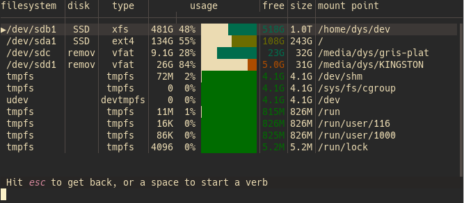

# Install a skin

To setup a new skin

1. download or create a configuration file, either TOML or Hjson, with a `skin` map
2. [import](../conf_file#imports) this file from the main one, either unconditionally or depending on the terminal's luma (dark or light)

If you installed broot since version 1.14, you should already have a few skins in your configuration directory.
You may look for other ones in the [dev repo](https://github.com/Canop/broot/tree/main/resources/default-conf).

The default configuration selects the skin according to the light or dark mode.

# Skin definition

A skin is defined by a `[skin]` section in a TOML or Hjson configuration file.

For example:

```Hjson
skin: {
	default: gray(23) none / gray(20) none
	tree: ansi(94) None / gray(3) None
	parent: gray(18) None / gray(13) None
	file: gray(20) None / gray(15) None
	directory: "#fb0 None Bold / ansi(172) None bold"
	exe: Cyan None
	link: Magenta None
	pruning: gray(12) None Italic
	perm__: gray(5) None
	perm_r: ansi(94) None
	perm_w: ansi(132) None
	perm_x: ansi(65) None
	owner: ansi(138) None
	group: ansi(131) None
	count: ansi(136) gray(3)
	dates: ansi(66) None
	sparse: ansi(214) None
	content_extract: ansi(29) None
	content_match: ansi(34) None
    device_id_major: ansi(138) None
    device_id_sep: ansi(102) None
    device_id_minor: ansi(138) None
	git_branch: ansi(229) None
	git_insertions: ansi(28) None
	git_deletions: ansi(160) None
	git_status_current: gray(5) None
	git_status_modified: ansi(28) None
	git_status_new: ansi(94) None Bold
	git_status_ignored: gray(17) None
	git_status_conflicted: ansi(88) None
	git_status_other: ansi(88) None
	selected_line: None gray(5) / None gray(4)
	char_match: Yellow None
	file_error: Red None
	flag_label: gray(15) None
	flag_value: ansi(208) None Bold
	input: White None / gray(15) gray(2)
	status_error: gray(22) ansi(124)
	status_job: ansi(220) gray(5)
	status_normal: gray(20) gray(3) / gray(2) gray(2)
	status_italic: ansi(208) gray(3) / gray(2) gray(2)
	status_bold: ansi(208) gray(3) Bold / gray(2) gray(2)
	status_code: ansi(229) gray(3) / gray(2) gray(2)
	status_ellipsis: gray(19) gray(1) / gray(2) gray(2)
	purpose_normal: gray(20) gray(2)
	purpose_italic: ansi(178) gray(2)
	purpose_bold: ansi(178) gray(2) Bold
	purpose_ellipsis: gray(20) gray(2)
	scrollbar_track: gray(7) None / gray(4) None
	scrollbar_thumb: gray(22) None / gray(14) None
	help_paragraph: gray(20) None
	help_bold: ansi(208) None Bold
	help_italic: ansi(166) None
	help_code: gray(21) gray(3)
	help_headers: ansi(208) None
	help_table_border: ansi(239) None
	preview_title: gray(23) None / gray(21) None
	preview: gray(20) gray(1) / gray(18) gray(2)
	preview_line_number: gray(12) gray(3)
	preview_match: None ansi(29)
	hex_null: gray(11) None
	hex_ascii_graphic: gray(18) None
	hex_ascii_whitespace: ansi(143) None
	hex_ascii_other: ansi(215) None
	hex_non_ascii: ansi(167) None
	staging_area_title: gray(22) None / gray(20) None
	mode_command_mark: gray(5) ansi(204) Bold
	good_to_bad_0: ansi(28)
	good_to_bad_1: ansi(29)
	good_to_bad_2: ansi(29)
	good_to_bad_3: ansi(29)
	good_to_bad_4: ansi(29)
	good_to_bad_5: ansi(100)
	good_to_bad_6: ansi(136)
	good_to_bad_7: ansi(172)
	good_to_bad_8: ansi(166)
	good_to_bad_9: ansi(196)
}
```
```toml
[skin]
default = "gray(23) none / gray(20) none"
tree = "ansi(94) None / gray(3) None"
parent = "gray(18) None / gray(13) None"
file = "gray(20) None / gray(15) None"
directory = "#fb0 None Bold / ansi(172) None bold"
exe = "Cyan None"
link = "Magenta None"
pruning = "gray(12) None Italic"
perm__ = "gray(5) None"
perm_r = "ansi(94) None"
perm_w = "ansi(132) None"
perm_x = "ansi(65) None"
owner = "ansi(138) None"
group = "ansi(131) None"
count = "ansi(136) gray(3)"
dates = "ansi(66) None"
sparse = "ansi(214) None"
content_extract = "ansi(29) None"
content_match = "ansi(34) None"
device_id_major = "ansi(138) None"
device_id_sep = "ansi(102) None"
device_id_minor = "ansi(138) None"
git_branch = "ansi(229) None"
git_insertions = "ansi(28) None"
git_deletions = "ansi(160) None"
git_status_current = "gray(5) None"
git_status_modified = "ansi(28) None"
git_status_new = "ansi(94) None Bold"
git_status_ignored = "gray(17) None"
git_status_conflicted = "ansi(88) None"
git_status_other = "ansi(88) None"
selected_line = "None gray(5) / None gray(4)"
char_match = "Yellow None"
file_error = "Red None"
flag_label = "gray(15) None"
flag_value = "ansi(208) None Bold"
input = "White None / gray(15) gray(2)"
status_error = "gray(22) ansi(124)"
status_job = "ansi(220) gray(5)"
status_normal = "gray(20) gray(3) / gray(2) gray(2)"
status_italic = "ansi(208) gray(3) / gray(2) gray(2)"
status_bold = "ansi(208) gray(3) Bold / gray(2) gray(2)"
status_code = "ansi(229) gray(3) / gray(2) gray(2)"
status_ellipsis = "gray(19) gray(1) / gray(2) gray(2)"
purpose_normal = "gray(20) gray(2)"
purpose_italic = "ansi(178) gray(2)"
purpose_bold = "ansi(178) gray(2) Bold"
purpose_ellipsis = "gray(20) gray(2)"
scrollbar_track = "gray(7) None / gray(4) None"
scrollbar_thumb = "gray(22) None / gray(14) None"
help_paragraph = "gray(20) None"
help_bold = "ansi(208) None Bold"
help_italic = "ansi(166) None"
help_code = "gray(21) gray(3)"
help_headers = "ansi(208) None"
help_table_border = "ansi(239) None"
preview_title = "gray(23) None / gray(21) None"
preview = "gray(20) gray(1) / gray(18) gray(2)"
preview_line_number = "gray(12) gray(3)"
preview_match = "None ansi(29)"
hex_null = "gray(11) None"
hex_ascii_graphic = "gray(18) None"
hex_ascii_whitespace = "ansi(143) None"
hex_ascii_other = "ansi(215) None"
hex_non_ascii = "ansi(167) None"
staging_area_title = "gray(22) None / gray(20) None"
mode_command_mark = "gray(5) ansi(204) Bold"
good_to_bad_0 = "ansi(28)"
good_to_bad_1 = "ansi(29)"
good_to_bad_2 = "ansi(29)"
good_to_bad_3 = "ansi(29)"
good_to_bad_4 = "ansi(29)"
good_to_bad_5 = "ansi(100)"
good_to_bad_6 = "ansi(136)"
good_to_bad_7 = "ansi(172)"
good_to_bad_8 = "ansi(166)"
good_to_bad_9 = "ansi(196)"
```

This would look like this:


Each skin entry value is made of

* a foreground color
* a background color (or `none`)
* zero, one, or more *attributes*

These tree parts can be repeated, after a `/`, to define the style to use in non focused panels (when more than one panel is used).

Example:

```hjson
directory: "ansi(208) None Bold / ansi(172) None"
```
```toml
directory = "ansi(208) None Bold / ansi(172) None"
```

## Color

A color in a skin or in the [ext_colors](../conf_file/#colors-by-file-extension) section can be:

* `none`
* an [Ansi value](https://en.wikipedia.org/wiki/ANSI_escape_code#8-bit), for example `ansi(160)`
* a grayscale value, with a level between 0 and 23, for example `grey(3)`
* a RGB color, for example `rgb(255, 187, 0)` or `#fb0`

Warnings:
* many terminals aren't compatible with RGB 24 bits colors (or aren't usually configured for)
* when using the hexa notation for colors (eg `#45ff1e`) in Hjson, the skin entry must be between quotes as the `#` character marks comments

## Style attributes

Currently supported attributes are:

* bold
* crossedout
* italic
* overlined
* reverse
* underlined

Note that some of them may be ignored by your terminal especially if you're not on a Unix system.

The mapping between keys and screen parts may not always be obvious. Don't hesitate to come ask for help on [Miaou](https://miaou.dystroy.org/3490?broot).

## Transparent background

If you want to set the background of broot transparent (i.e. to be the background of your terminal), you can set the default style like this:

```hjson
default: "gray(23) none / gray(20) none"
```
```toml
default = "gray(23) none / gray(20) none"
```


## Good to Bad scale

The `good_to_bad_0` to `good_to_bad_9` entries define a scale used to express the cluttering of filesystems:



Only the foreground color is used, so you may use the shortened definition, eg

```hjson
good_to_bad_9: rgb(200, 15, 14)
```

There's no obligation to really use a green to red scale. You may even use only one color if you like.

# Contribute your own skin

Don't hesitate to contact me on [Miaou](https://miaou.dystroy.org/3490) if you have a skin to propose or to discuss an existing one.

