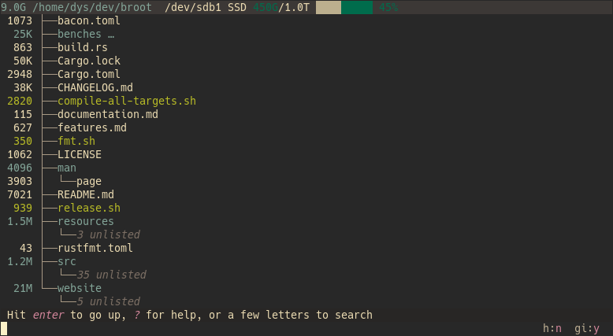
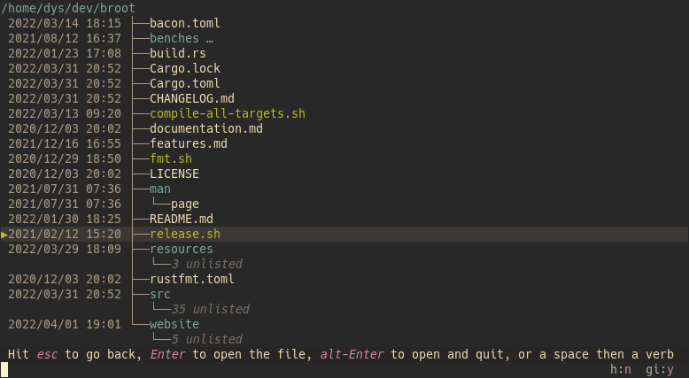
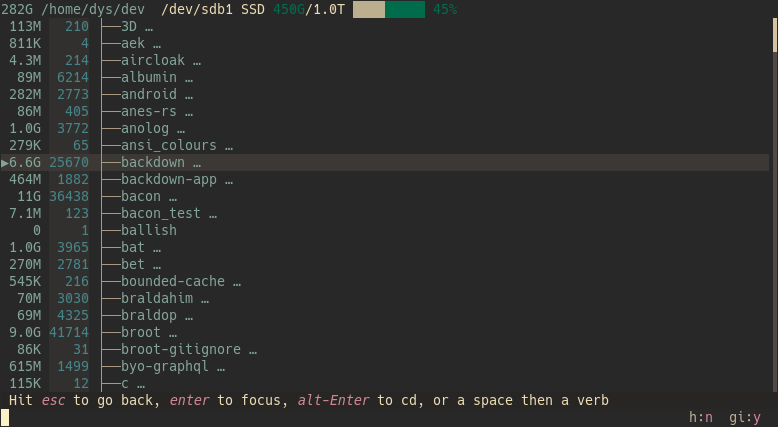
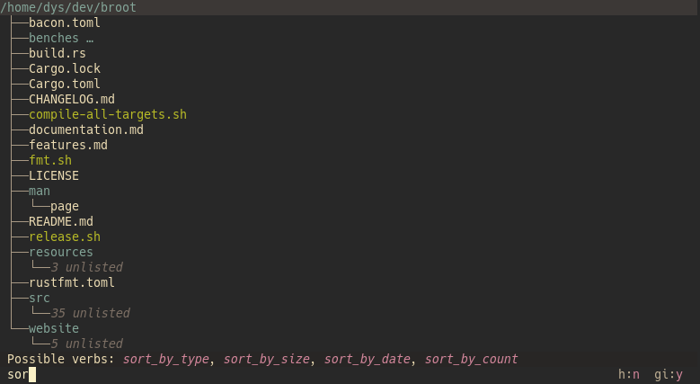
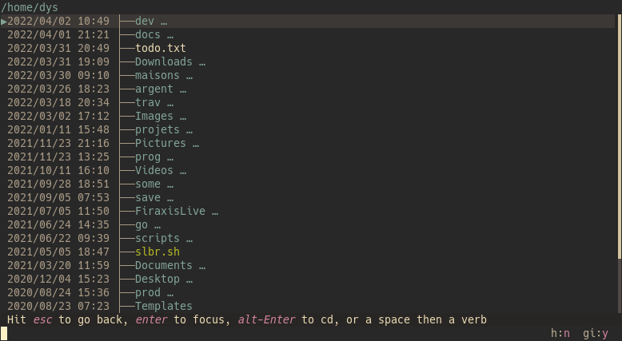
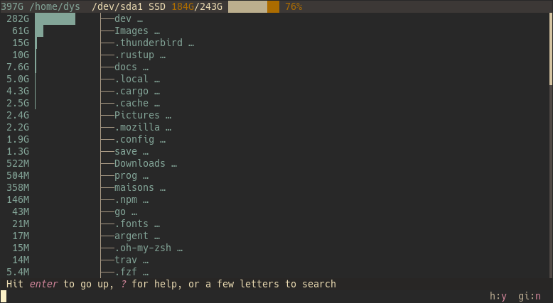

# Introduction

The tree view gives you an overview of the current directory, fitting into your screen even when there are millions of files.

It does so with a parallel trimming of child directories to give you a balanced view:

This basic representation will probably be the one you'll most frequently use but you'll also want at times

- to show hidden files, or gitignored ones
- to show the many properties of the files and directories
- to sort files
- to disable trimming
- to show git work information
- to show the device's occupation
- to trim or not

# hidden & gitignored files

With default configuration, hidden files (the ones whose name starts with a dot) and gitignored files (when in a git repository) are initially hidden.

If you don't want to hide those files, you may either

1. launch broot with flags: `br -hi` would show both categories, try `br --help` to see the description of those flags
2. set the flags directly in your config file: see [default flags](../conf_file/#default-flags)
3. toggle hiding when in the application

The toggle commands are `:toggle_hidden` (shortcut: `:h`)  and `:toggle_git_ignore` (shortcut: `:gi`).

If you use those toggles frequently enough, you'll remember the <kbd>alt</kbd><kbd>h</kbd> <kbd>alt</kbd><kbd>i</kbd> key combinations.

And if you forget the combinations, have a look at [the help](../help/#verbs).

# File Properties

File properties are shown with "toggle" commands, which have shortcuts and which can be [bound](../conf_verbs/#keyboard-key) to key combinations if you want.

## Owner and Permissions

Use `:toggle_perm` (shortcut: `:perm`) to show unix permissions (depending on your system):

(you could have them from the start by launching broot with `br -p`)

## Sizes

Use `:toggle_sizes` (shortcut: `:size`) to show the size of files and directories.

The size of directories is computed in background: if you have a great number of files in some directories, their size may not be displayed immediately but you can go on using broot while the computation is done (results are cached so you may move around and come back to find the sizes already here).

To the right of the name of the root directory, you'll notice some disk information: type, total size, occupation. This is the disk holding the root directory (and most usually also its children).

!!!	Note
	The displayed size on Unix is the space the file takes on disk, that is the number of blocks multiplied by the size of a block. If a file is sparse, a little 's' is displayed next to the size.

## Last Modification Dates

The last modification date is computed in a very similar way: it's the max modification date of a directory's content.

You display it with `:toggle_dates` (shortcut: `:dates`).

## Counts

Similar again is the number of files in directories (or `1` for files).

Here it is, combined with the sizes:

# Sort

By default, files are sorted with a rough alpha order.

To see the available sorts, type `:sort`: broot proposes you the possible completions (you may rotate between them with the <kbd>tab</kbd> key):

There are 4 kinds of sort:

* sort by date
* sort by count
* sort by size
* sort by type, with directories either first or last

The 3 first kinds involve that only one level of files is displayed, there's no visible file hierarchy.

Here's for example all files of my home directory sorted by date (this is a cool way to find out on Monday morning what you were doing before the week-end):

## Whale Mode

Sorting by size is the basis of the "whale mode" (dedicated to finding the big fat files).
This mode involves also showing all files.

You start it with `br -w` and it sports bars to make relavive sizes more obvious:

# Git information

With `:toggle_git_file_info`) (shortcut: `:gf`) you can see what files have been modified, or are new.

The top line tells you on what branch you are and summarizes changes:

With [some customization](https://dystroy.org/blog/gg/) you have the perfect tool for reviewing your changes before a commit.

# All Toggles

Each of those toggles lets you alternate between 2 or 3 modes.

 | name                 | shortcut |  key  |description
 |----------------------|----------|-------|----------------------------------------------
 | toggle_counts        | counts   |       | toggle showing deep counts of files in directories
 | toggle_dates         | dates    |       | toggle showing last modified dates (deep computed)
 | toggle_files         | files    |       | toggle showing files (or just folders)
 | toggle_git_file_info | gf       |       | toggle display of git file information
 | toggle_git_ignore    | gi       | <kbd>alt</kbd><kbd>i</kbd> | toggle use of .gitignore
 | toggle_hidden        | h        | <kbd>alt</kbd><kbd>h</kbd> | toggle showing hidden files
 | toggle_perm          | perm     |       | toggle showing file permissions (Unix only)
 | toggle_sizes         | sizes    |       | toggle showing sizes
 | toggle_trim_root     | t        |       | toggle removing nodes at first level too
 | toggle_tree          | tree     |       | toggle showing file tree (when not affected by sorting mode)

To apply one, type a space (or `:`), then the start of its shortcut, then hit <kbd class=b>⏎</kbd>.

For example typing `:s` then enter will show file and directory sizes.

Those toggles may also be defined with [launch options](../launch) and the [default_flags preference](../conf_file/#default-flags). And you can see them in the application with <kbd>?</kbd>.

