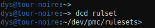
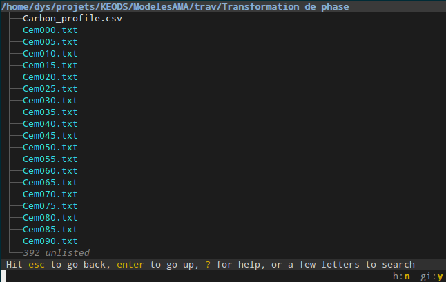

# Replace tree

This bash function gives you a better `tree` optimizing for the height of the screen:

	function tree {
	     br -c :pt "$@"
	}


This function supports most broot arguments:


# Search deeper

The search normally stops after some time, or when it found enough matches (that is a few times what can be displayed, in order to only show the ones with the best ranking).

Sometimes, you want a more exhaustive search:

- you want to see **all** matches
- you want the search to go deeper to find better ranked matches, even if it's slower

Then, you can hit <kbd>ctrl</kbd><kbd>s</kbd>, which does a `:total_search` and ensures the whole tree is searched and all matches are displayed.

The downside is it takes time and the most relevant matches may be hard to find among hundred of less relevant ones which wouldn't be shown otherwise.

# A generic fuzzy finder

The goal here is to have a function you can use in shell to give you a path.

**Step 1:** create a file `~/.config/broot/select.toml` with this content:

```Hjson
verbs: [
    {
        invocation: "ok"
        key: "enter"
        leave_broot: true
        execution: ":print_path"
        apply_to: "file"
    }
]
```
```TOML
[[verbs]]
invocation = "ok"
key = "enter"
leave_broot = true
execution = ":print_path"
apply_to = "file"
```

**Step 2:** create a shortcut of some type, for example using  `~/.bash_aliases`

```
alias bo="br --conf ~/.config/broot/select.toml"
```

**Step 3:** you can then use broot as a selector in other commands:

```
echo $(bo)
```
or

```
echo $(bo some/path)
```

Here, the configuration file was used to ensure you can select a file with the enter key.

You may use the same configuration file to also specify colors to remember yourself you're not in a standard broot.


# `dcd` : Deep fuzzy cd

When you want to cd to a deep directory, using `br` is fast and easy enough:

* you type `br` (and `enter`)
* you type the name of the deep folder (or part of it)
* you check the right line is selected
* you do `alt-enter`
* you're done

But when you frequently go to a few specific places, you may prefer a shortcut.

As broot can be driven by commands, you can define this function:

	# deep fuzzy cd
	function dcd {
		br --only-folders --cmd "$1;:cd"
	}

(paste this for example in your .bashrc)

This is the *"I'm feeling lucky"* of broot, you can use it to directly jump to directories you know, when you don't need the interactive search of br.

Example:



# Focus a new directory but keep the current filter

When you hit `enter` on a directory, it's focused and the filter is reset.

If you want to keep the filter, for example to search deeper, you may use `:focus` instead (or  you can bind it to a key shortcut).

# Go to the directory containing the selected file

Suppose you filter to find a file, and it's in a deeper directory, you may want to see it "more closely", that is, keeping the filter, to make its parent directory the current root.

This can be done with the `:focus` verb which can be called with <kbd>ctrl</kbd><kbd>f</kbd>.

# Run a script or program from broot

If your system is normally configured, doing `alt`-`enter` on an executable will close broot and execute the file.

# Change standard file opening

When you hit enter on a file, broot asks the system to open the file.
It's usually the best solution as it selects the program according to the file's type and to settings you set system wide.

If you're editing text files in your terminal (vi, emacs, helix, etc.), then you'd rather have your editor open in the same terminal on enter, and be back to broot on quitting it.

Here's an example:

```Hjson
{
    invocation: edit
    key: enter
    shortcut: e
    execution: "/usr/bin/nvim +{line} {file}"
    apply_to: text_file
    leave_broot: false
}
```
```TOML
[[verbs]]
invocation = "edit"
key = "enter"
shortcut = "e"
execution = "/usr/bin/nvim +{line} {file}"
apply_to = "text_file"
leave_broot = false
```

You'll also need such kind of setting if your computer is missing xdg-open or equivalent.

If you need to use a different application for some kind(s) of file, you may additionally [filter by extension](../conf_verbs/#file-extensions).

# Git Status

If you want to start navigating with a view of the files which changed, you may do

    br -ghc :gs

Then just hitting the `esc` key will show you the normal unfiltered broot view.

(note: this isn't equivalent to `git status`. Most notably, removed files aren't displayed)

From there you may use the `:gd` verb (`:git_diff`) to open the selection into your favourite diff viewer.

If you want more: [Use broot and meld to diff before commit](https://dystroy.org/blog/gg/).

# Use negative filters

Here's a (real) example of how negative filters and combination can help you navigate.

Here's the initial view of a directory in which you land:



Type `!txt` to hide unwanted files:


(it's filtered as you type so you stop at `!tx`, it's enough)

Now let's add `&` then some letters of what we want.


We can also select the desired file with arrow keys at this point.

When you grasped the basic logic of [combined filters](../input/#combining-filtering-patterns), navigation is incredibly efficient.

# Use composite searches in preview

You can apply composition and negation to searches in the preview panel which is convenient when filtering, for example, a log file.

In this example I show lines containing "youtube" but not "txt" nor " 0 ms".


# Escape key

Broot usage, just like vim, relies a lot on the <kbd>esc</kbd> key. If you're a frequent user of the terminal, you may want to remap an easy to reach and otherwise useless key (for example caps-lock) to <kbd>esc</kbd>.

This brings a lot of comfort, not just in broot.

# Vim integration/plugin

In case you want to use broot for opening files fuzzily in vim (and potentially
replace netrw), check out: [broot.vim](https://github.com/lstwn/broot.vim)

