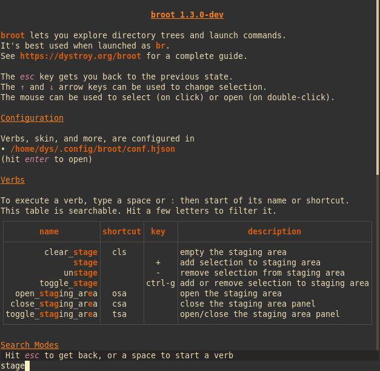
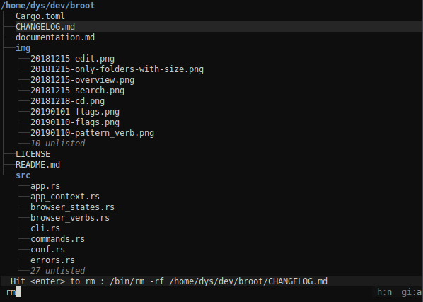
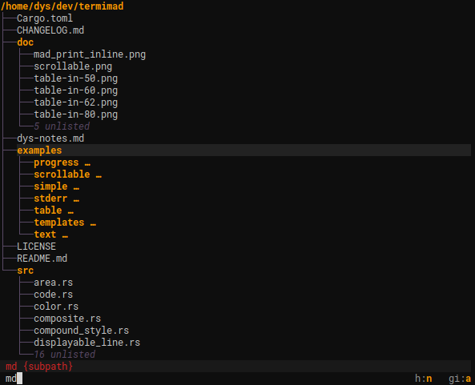
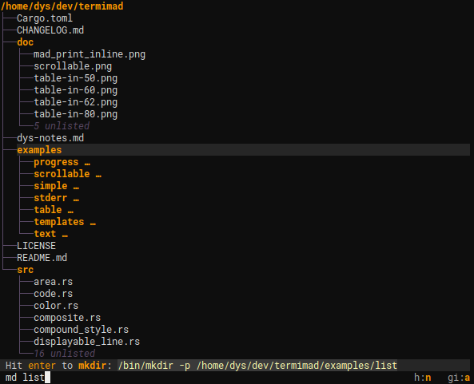

When you used a toggle, you executed a command in it simplest form: without argument and independent from the current selection.

The simplest verbs are just executed by typing a space (or `:`), then its first letters, then enter.

A verb can be related to the current selection. For example typing `:p` will execute the `:parent` verb, which focuses the parent of the selection (*focusing* a directory means making it the current root).

Verbs are listed in help. As there are many of them, it can be sometimes useful to use pattern filtering to look at what's available for your concern. For example to see [stage](../staging-area) related verbs and their shortcuts:



# Verbs using the selection

The `rm` verb executes the standard `rm` command.

It's defined by this couple (invocation, external):

```Hjson
invocation: "rm"
external: "rm -rf {file}"
```
```TOML
invocation = "rm"
external = "rm -rf {file}"
```

Selection based arguments:

name | expanded to
-|-
`{file}` | the complete path of the current selection
`{parent}` | the complete path of the current selection's parent
`{directory}` | the closest directory, either `{file}` or `{parent}`
`{other-panel-file}` | the complete path of the current selection in the other panel
`{other-panel-parent}` | the complete path of the current selection's parent in the other panel
`{other-panel-directory}` | the closest directory, either `{file}` or `{parent}` in the other panel

Several selection based arguments can be used. For example the (built-in) `:copy_to_panel` verb is defined as

```Hjson
invocation: "copy_to_panel"
external: "cp -r {file} {other-panel-directory}"
```
```TOML
invocation = "copy_to_panel"
external = "cp -r {file} {other-panel-directory}"
```

When you type a verb, the execution pattern is completed using the selection(s), the exact command is displayed in the status line:



As for filters, hitting <kbd>esc</kbd> clears the command.


# Verbs using user provided arguments

Some commands not only use the selection but also takes one or several argument(s).

For example mkdir is virtually defined as

```Hjson
invocation: "mkdir {subpath}"
external: "mkdir -p {directory}/{subpath}"
```
```TOML
invocation = "mkdir {subpath}"
external = "mkdir -p {directory}/{subpath}"
```

(it's now a built-in, you won't see it in the config file)

which means that if you type `c/d`, and the file `/a/b/some_file.rs` is selected, then the created directory would be `a/b/c/d`.

Example:

Before you type a subpath, broot tells you, in red, the argument is missing:



If you type an argument, the command to execute is computed and shown:



In this screenshot, you didn't type `mkdir` or its start but `md`. That's because the complete definition of this verb includes this line:

```Hjson
shortcut: "md"
```
```TOML
shortcut = "md"
```

!!!	Note
	The help screen lists the whole set of available verbs, including the ones coming from the configuration.

# Tab completion

When you type a verb, a few letters are often enough because broot just want enough of them to be sure there's no confusion.
But sometimes there are a lot of verbs with the same start (especially if you add them liberally in the config file). You might want to have broot complete or propose the few possible completions. The <kbd>tab</kbd> key can be used for this purpose.

Tab completion is probably more useful even with paths you provide to verbs. It works intuitively.

Note: there's another solution to gain time when typing a path, especially when you're not sure of it: hitting <kbd>ctrl</kbd><kbd>p</kbd> will open a new panel in which you can navigate until you have your selection that you validate with another hit on <kbd>ctrl</kbd><kbd>p</kbd> (see [panels](panels.md)).

# Builtins & external commands, leaving or not

There are three types of verbs (they will be covered in more details in the [configuration page](../conf_verbs/#verb-definition-attributes)):

* builtin features apply internal functions, for example `:toggle_perm` to trigger computation and display of Unix file permissions
* external commands, whose execution implies calling an external program, for example `rm -rf {file}`
* sequences of commands

A command may leave broot (for example to start a program), or not (the tree will be refreshed).

# Open in new panel with `!`

The exclamation mark can be used to open the execution result in a new panel instead of replacing the current one.

It can be located before or after the verb.

Examples:

command | result
-|-
:fo! | focus the current directory in a new panel
:!he | open the help side to your content
:!fo ~ | show your home directory in a new panel

It can be used in a verb declaration in configuration too.

# Adding verbs

You may start with the common set of verbs but you'll very quickly want to define how to edit or create files, and probably have a few personal commands.

That's why should see [how to configure verbs](../conf_verbs/#verbs-shortcuts-and-keys).
