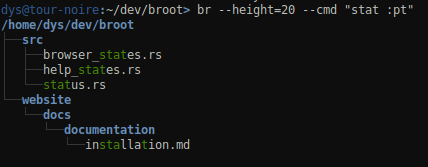
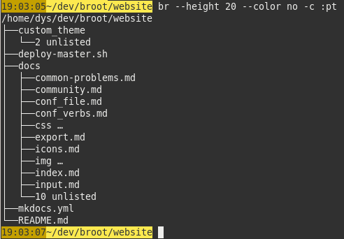

If you want to use the pruned tree out of broot (for example for a documentation), you may use the `:print_tree` verb.

It can be used in several ways.

The easiest is to execute it from inside the application (the verb is also accessible with the `:pt` shortcut). This quits broot and you find the tree on your console, without the status line and the input, but with the same filtering state as when you were browsing.

Example with a filter:

Example without style or color, thanks to `--color no`:

This is also how would look the tree directly exported into a file.

With the `--out` command, the tree is written in a given file. For example `br --out test.txt`.

You can also  redirect the output of broot in a standard unix way.

You don't have to enter broot, you may also directly get the tree by using the [`--cmd` argument](../launch/#the-cmd-launch-argument). An additional parameter may come handy: `--height` which specifies the size of the virtual screen, which may be smaller or bigger than the real one (no problem if you want 10000 lines).

For example

    br --cmd ":pt" > my_file.txt

will export the local tree to the `my_file.txt` file.

Or

    br > tree.txt

in which case you'll manually do `:pt` when in broot but after having had the opportunity to navigate, filter and change toggles as desired.

