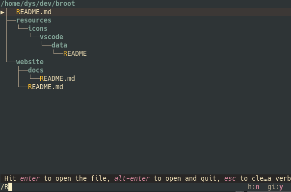
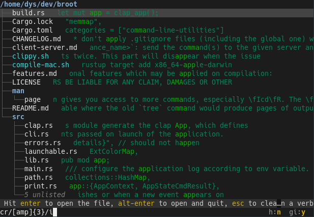
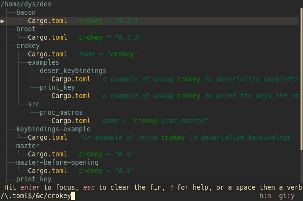

# General form

The input is the area at the bottom of the focused panel, in which you can type a filter or a command.

Its parts are

* a filtering pattern
* a verb invocation, starting with a space or a colon (`:`)

Both parts are optional.

# The filtering pattern

A search pattern is made of 1 to 3 parts separated by the `/` character but you rarely need the two `/`.

The syntax is globally

    <mode><pattern>[/<flags>]

The mode is either nothing (fuzzy path), just a slash (regex name) or some letters followed by a slash.

The search mode combines

* the search type: fuzzy, regex, exact, tokens
* the search object: file name, file path, file content

mode | example query | example match | explanation
-|-|-|-
fuzzy path | `abc`  or `p/abc` | `a/bac.txt` |  search for "abc" in a fuzzy way in sub-paths from current tree root
fuzzy name | `n/abc` or `nf/abc` | `abac.txt` | search for "abc" in a fuzzy way in filenames
tokens name | `nt/ab,cd` | `dcdAbac.txt` | search for the "ab" and "cd" tokens, in whatever order (case and diacritics insensitive)
exact name | `e/Bac` or `en/Bac` | `ABac.txt` | search for the string "Bac" in filenames
regex name | `/[yz]{3}` or `/[yz]{3}/` | `fuzzy.rs` | search for the regular expression `[yz]{3}` in filenames
regex name | `/(json|xml)$/i` | `thing.XML` | find files whose name ends in `json` or `xml`, case insensitive
regex name | `/abc/i` | `aBc.txt` | search for the regular expression `abc` with flag `i` in filenames
exact path | `ep/te\/d`  or `pe/te\/d/` | `website/docs` |  search for "te/d" in sub-paths from current tree root
regex path | `rp/\d{3}.*txt` | `dir/a256/abc.txt` |  search for the `\d{3}.*txt` regex  in sub-paths from current tree root
tokens path | `t/ab,cd` | `DCD/a256/abc.txt` |  search for the "ab" and "cd" tokens in sub-paths from current tree root
exact content | `c/mask` or `c/mask/` | `umask = "1.0"` | search for the "mask" string in file contents
regex content | `rc/[abc]{5}/i` | `bAAAc` | search with a regular expression in file contents - `i` making it case insensitive
regex content | `cr/\bzh\b` | `"zh":{` | search a word with a regular expression in file contents

It's also possible to [redefine those mode mappings](../conf_file/#search-modes).

# Combining filtering patterns

Patterns can be combined with the `!` (not), `&` (and) and `|` (or) operators, and parentheses if necessary.

You can for example list files whose name contains a `z` and whose content contains one too with

    z&c/z

To display non `json` files containing either `isize` or `i32`, type

    !/\.json$/&(c/isize/|c/i32/)

The last closing characters are often unnecessary when no ambiguity is possible, so you could have typed this:

    !/\.json$/&(c/isize/|c/i32

# Escaping

## Why escaping ?

Look at this input: `a|b rm`.

It's for searching files whose name contains either a `a` or a `b`, then removing the selected one.
The pattern here is `a|b`, it's a composite pattern.

A space or a colon starts the verb invocation.
So if you needs one of them in your pattern, you need to escape it with `\`.

For example

* to search for a file whose name contains a x and a colon, you type `x\:`
* to search for a file whose name contains a space just before a digit, you can use a regular expression: `/\ \d`

The characters you use as operators and the parenthesis can be useful in patterns too, either because you want to search for them in fuzzy patterns or in file contents, or because you write non trivial regular expressions.

If you want to search for the `|` character (or a `&`, or `(`, or `)`), you can't just type it because it's used to combine elementary patterns. I needs escaping. So if you need to search for the `|` character in file names, you type `\|`.

An elementary pattern which starts with a `/` can only be ended with a `/`, a space, or a colon.
That's why you don't have to escape other characters you want to include in your elementary pattern.

This lets you type this regular expression with no unnecessary escaping:

    /(\d-){2}\w

Regular expression escaping rules still apply, so if you want to search with a regex for a file containing a `(`, you'll type `/\(`.

## Escaping Rules

The escaping character is the antislash `\`.

Most often, you don't need to know more: when broot tells you it doesn't understand your pattern, it should click that your special character needs escaping and you prefix it with a `\ `.

More precisely:

1. After the first `/` of a pattern, only ` `, `:`,  `/` and `\` need escaping.
2. Otherwise, `&,` `|`, `(`, `)`, `\` need escaping too.
3. When there's no ambiguity, ending characters are often unnecessary
4. Two successive `:` in pattern position may be left unescaped

# Performances

broot interprets the left operand before the right one and doesn't interpret the second one if it's not necessary.

So if you want to search your whole disk for json files containing `abcd`, it will be faster to use `/\.json$/&c/abcd` rather than `c/abcd/&/\.json$/` which would look at the file name only after having scanned the content.

# The verb invocation

The verb invocation is

    :<verb><arguments>

or

    <space><verb><arguments>

where arguments can be empty, depending on the verb's behaviour and invocation pattern.

Verbs are detailed in the [Verbs & Commands](verbs.md) chapter.

# Examples

## Fuzzy Path search

`re`

## Regular expression based search

`/R`

## Search followed by a command without arguments

`re rm` (which is equivalent to `re:rm`)

This is very natural: You use the search to select your element and you don't need to remove it before typing the command.

## Search followed by a command taking an argument

`re mv ../regex.rs`

## Full text search

In this case with an escaped space:

`c/two\ p`

## Regular expression based full text search

## Search by name/extension and content

Here's searching files whose name ends in "toml" and containing "crokey":

`/\.toml$/&c/crokey`

In practice, you won't usually bother with the `\.`. And if you want to cover `"TOML"` too, you'll add a `i`: `/toml/i&c/crokey`.

## Complex composite search

Here we search for `"carg"` both in file names and file contents, and we exclude `"lock"` files:

`!lock&(carg|c/carg/)`

note: the `/` at the end of `c/carg/` is necessary to tell broot that the following parenthesis isn't part of the pattern.
